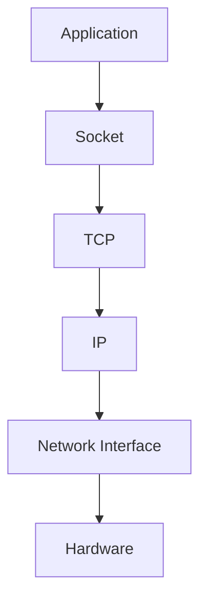
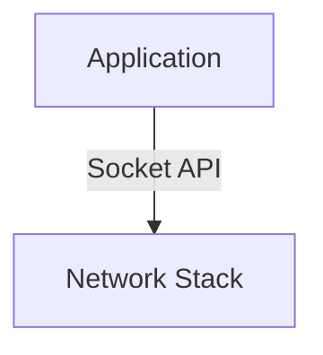
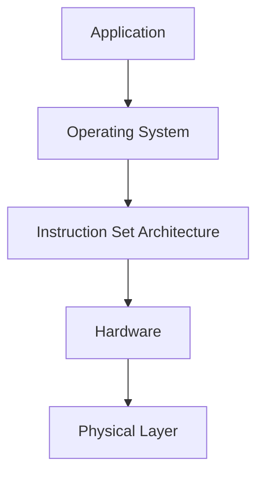
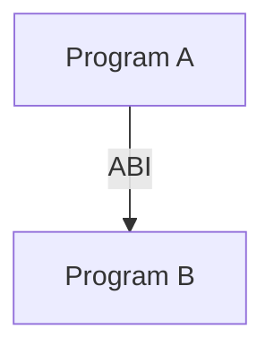
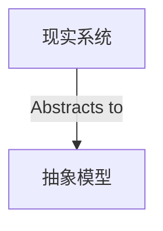
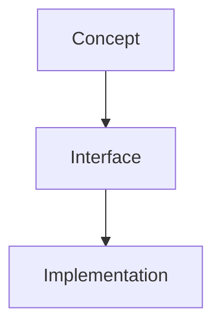
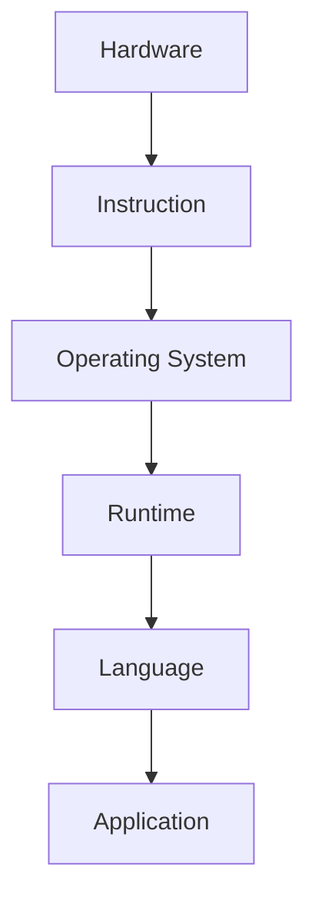

# Abstraction（抽象）

## Definition

抽象（Abstraction）是计算机科学中用于控制复杂性的核心思想。

它通过隐藏不必要的实现细节，只暴露使用者需要关注的接口和模型，使复杂系统能够被理解和使用。

简单来说：

> 抽象是忽略细节，保留关键特征。

---

# 为什么需要抽象？

现代计算机系统非常复杂。

例如：

一个应用程序发送网络请求：



应用程序并不需要知道：

- 数据包如何编码
- 路由如何选择
- 网卡如何发送信号

它只需要使用：

```
Socket Interface
```

即可完成通信。

---

# 抽象的核心思想

## 1. 隐藏实现细节

使用者关注：

```
What
```

而不是：

```
How
```

例如：

数据库：

用户：

```
SELECT * FROM User
```

不需要关心：

- 数据存储位置
- 索引结构
- 磁盘布局

---

## 2. 提供统一接口

不同实现可以通过相同接口使用。

例如：

文件系统：

```
read()

write()

close()
```

可以操作：

- 普通文件
- 管道
- Socket
- 设备

---

## 3. 降低系统耦合

抽象层之间只依赖接口。

例如：



应用程序不需要依赖具体网络实现。

---

# 抽象层级

计算机系统通常由多个抽象层组成：



每一层：

- 使用下一层提供的能力
- 向上一层提供接口

---

# 常见抽象实例

## 1. 操作系统抽象

### Process

硬件实际执行的是：

- CPU 指令
- 内存访问

操作系统抽象为：

```
Process
```

提供：

- 独立运行环境
- 资源管理

---

### File

硬件实际：

- 磁盘块
- 扇区

操作系统抽象为：

```
File
```

提供：

- read
- write

---

### Socket

底层：

- TCP/IP
- 网络设备
- 数据传输

操作系统抽象为：

```
Socket
```

提供：

- 通信接口

---

## 2. 网络抽象

Internet 并不是按照硬件设备描述：

```
Router
Cable
NIC
```

而是抽象为：

```
Host

Network Core

Link
```

关注：

- 通信关系
- 数据流动
- 功能角色

而不是：

- 具体设备型号

---

## 3. 编程语言抽象

高级语言：

```
for loop

class

function
```

隐藏：

- CPU 指令
- 寄存器操作
- 内存管理

---

## 4. ABI

ABI 是程序之间的抽象边界。



隐藏：

- 编译器实现
- 调用约定细节

提供：

- 二进制兼容接口

---

# 抽象与现实的关系

抽象不是完全脱离现实。

正确理解：



抽象：

- 简化现实
- 保留关键性质

不是：

- 完全模拟现实
- 完全忽略现实

---

# 抽象的限制

抽象隐藏复杂性，但不会消除复杂性。

例如：

Socket 隐藏：

- TCP 状态
- 网络传输细节

但是：

网络异常时：

- 延迟
- 丢包
- 连接失败

仍然需要理解底层。

---

# 抽象与实现

关系：



例如：

Socket：

概念：

```
通信端点
```

接口：

```
Socket API
```

实现：

```
TCP Socket

Unix Domain Socket
```

---

# CS 中的核心理解

计算机科学不是直接管理复杂现实。

而是不断建立抽象：



每一层：

- 隐藏底层复杂性
- 提供新的能力
- 建立新的抽象模型

---

# Summary

抽象（Abstraction）：

> 通过隐藏实现细节，保留关键特征，并提供稳定接口，使复杂系统能够被理解、使用和扩展。

核心关键词：

- Hide Details
- Expose Interface
- Reduce Complexity
- Separate Concept and Implementation

---

# 关联概念

- [[Interface]]：接口定义
- [[Layering]]：分层机制
- [[Role-vs-Implementation]]：角色与实现
- [[CS/00-Overview/Socket|Socket]]：通信端点接口