# Interface（接口）

## Definition

Interface（接口）是系统之间进行交互的边界。

它定义：

- 可以做什么（What）
- 如何使用（How to interact）

但不暴露：

- 内部如何实现（How it works）

简单理解：

> Interface 是不同系统或模块之间约定的通信方式。

---

## Types

Interface 可以根据交互对象不同分为：

- [[API]]：程序与程序之间的调用接口 
- [[ABI]]：二进制程序之间的交互接口
- 其他

---
# 为什么需要 Interface？

复杂系统通常由多个部分组成。

如果每个部分直接依赖其他部分的实现：

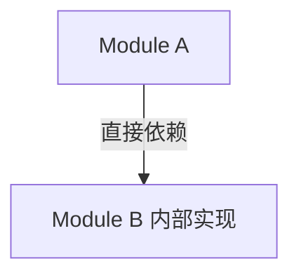

会导致：

- 高耦合
- 难以修改
- 难以扩展

通过 Interface：

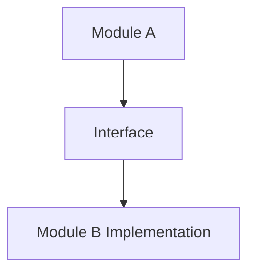

A 只依赖接口，而不是具体实现。

---

# Interface 与 Abstraction 的关系

二者经常一起出现。

## Abstraction

关注：

> 隐藏什么？

例如：

Socket 隐藏：

- TCP 状态
- 网络设备
- 数据传输细节

---

## Interface

关注：

> 如何使用？

例如：

Socket API：

```
socket()

connect()

send()

recv()
```

---

关系：

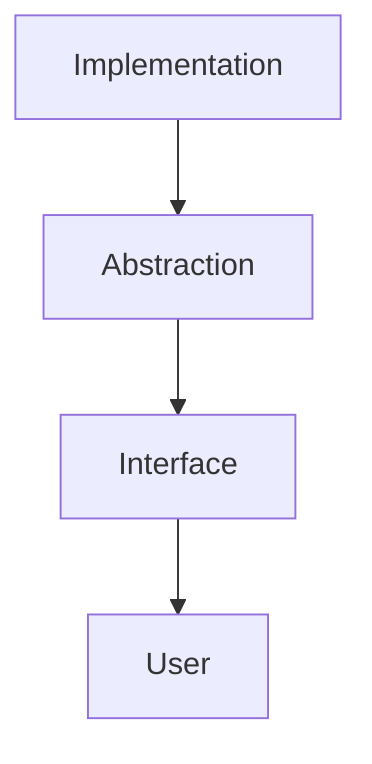

---

# Interface 的核心作用

## 1. 隔离实现

使用者只依赖接口：

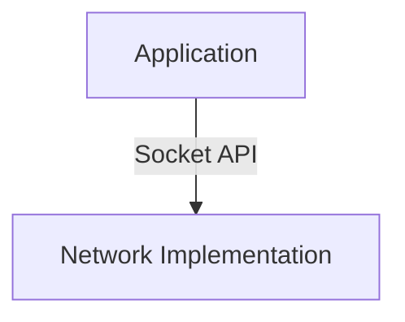

网络实现变化：

- TCP
- UDP
- Unix Domain Socket

应用程序不需要改变。

---

## 2. 降低耦合

没有接口：

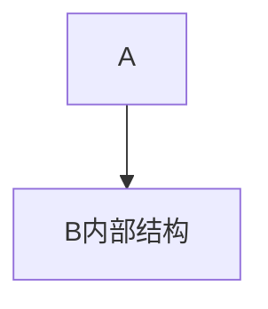

B 修改：

```
A 必须修改
```

有接口：

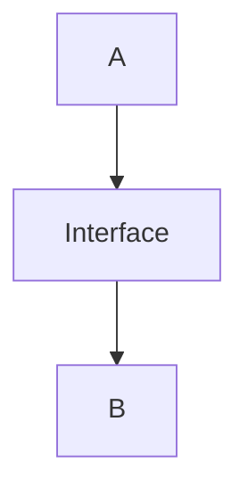

B 可以替换实现。

---

## 3. 支持替换实现

例如：

数据库接口：

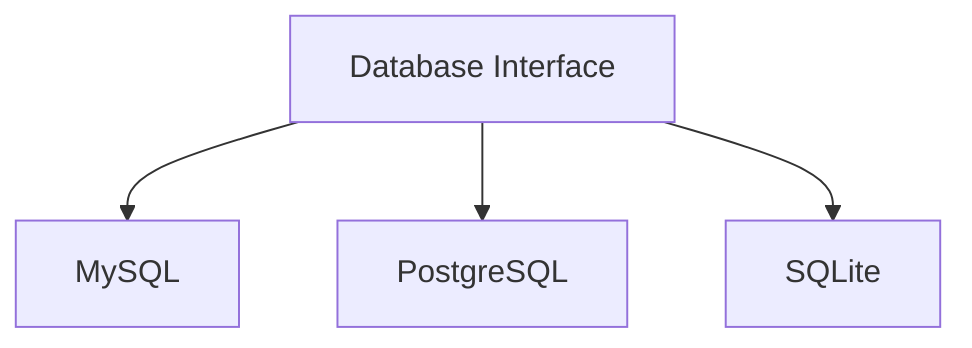

上层代码只依赖接口。

---

# 计算机系统中的 Interface

## 1. API（Application Programming Interface）

应用程序接口：

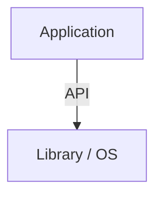

例如：

```
printf()

open()

socket()
```

---

## 2. ABI（Application Binary Interface）

二进制接口：

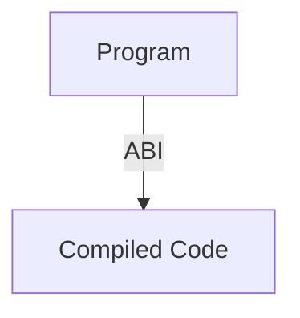

负责：

- 函数调用约定
- 数据布局
- 二进制兼容

---

## 3. System Call Interface

用户程序和操作系统之间：

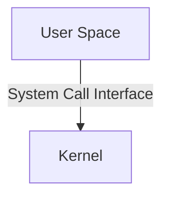

例如：

```
open()

read()

fork()
```

---

## 4. Socket Interface

网络通信接口：

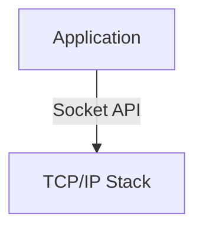

应用程序不需要了解：

- 数据包如何传输
- 路由如何选择

---

# Interface 与 Implementation

核心关系：

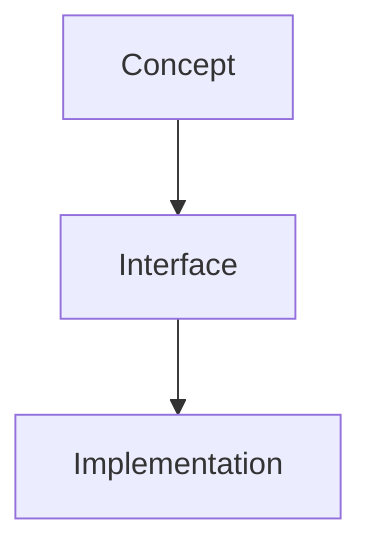

例如：

## 文件

Concept：

```
Storage
```

Interface：

```
read()
write()
```

Implementation：

```
Disk File

Pipe

Socket
```

---

## Socket

Concept：

```
Communication Endpoint
```

Interface：

```
socket()
send()
recv()
```

Implementation：

```
TCP Socket

Unix Domain Socket
```

---

# Interface 的抽象层次

计算机系统中存在大量接口：

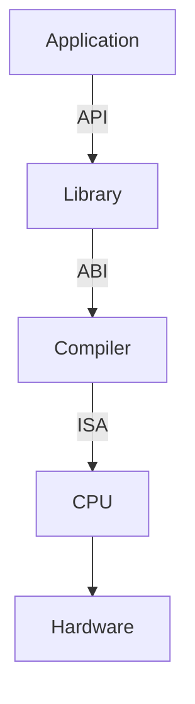

每一层通过接口连接。

---

# Interface 的设计思想

好的 Interface：

## 稳定

实现可以变化。

接口尽量保持稳定。

---

## 简洁

暴露必要能力。

隐藏无关细节。

---

## 可组合

不同模块可以通过接口连接。

---

# 常见误区

## Interface 不等于 Implementation

例如：

```
USB
```

不是：

```
USB Controller 的具体实现
```

而是：

通信标准和接口规范。

---

## Interface 不等于 API

API 是 Interface 的一种。

Interface 范围更广：

包括：

- API
- ABI
- Protocol Interface
- Hardware Interface

---

# Summary

Interface（接口）：

> 系统之间约定交互方式的边界，用于隐藏实现细节、降低耦合，并允许不同实现进行替换。

核心关键词：

- Boundary
- Contract
- Decoupling
- Replaceability
- Abstraction

---

# 关联概念

- [[API]]：应用程序编程接口
- [[ABI]]：应用程序二进制接口
- [[CS/00-Overview/Socket|Socket]]：通信端点接口
- [[Abstraction]]：抽象思想