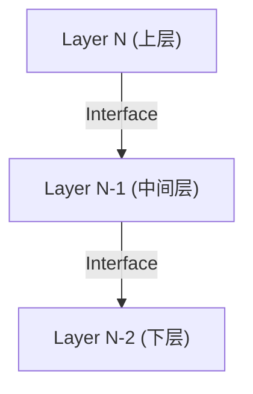
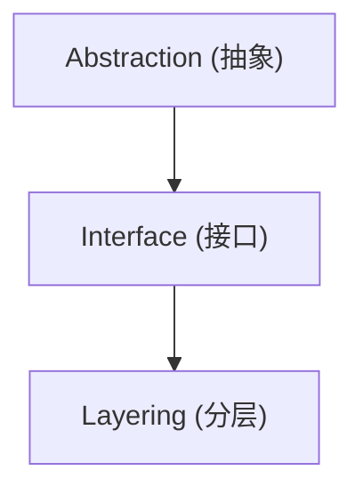
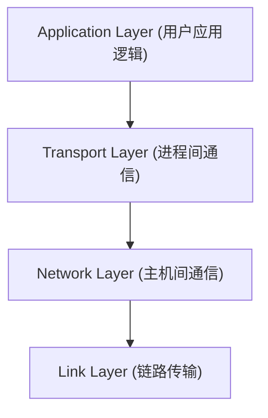
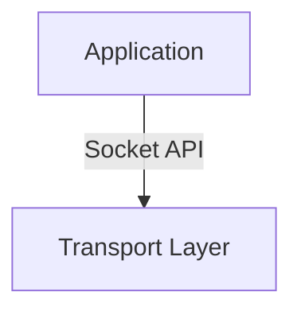
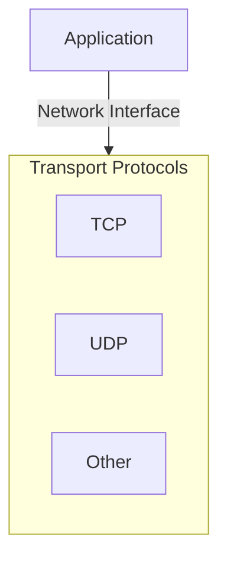
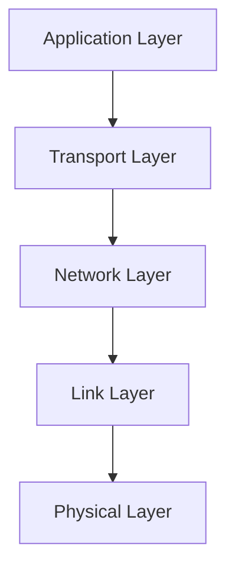
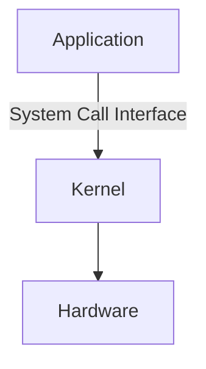
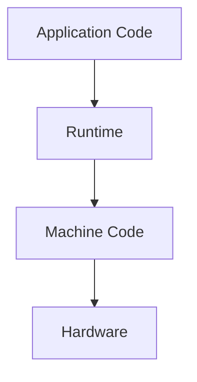

# Layering（分层）

## Definition

分层（Layering）是一种组织复杂系统的方法。

它将系统划分为多个具有明确职责的层，每一层：

- 使用下一层提供的服务
- 向上一层提供接口
- 隐藏自身实现细节

简单理解：

> 分层是通过多个抽象边界管理复杂性的架构方式。

---

# Core Idea

一个分层系统：

每一层只关注自己的职责，不需要了解其他层的内部实现。

---

# Relationship with Abstraction

分层建立在抽象之上。

关系：

- Abstraction：隐藏复杂性
- Interface：定义交互边界
- Layering：组织多个抽象层

---

# Characteristics

## 1. Separation of Responsibility（职责分离）

每一层负责不同的问题。

例如计算机网络：

---

## 2. Interface-based Interaction（基于接口交互）

层与层之间通过接口通信。

例如：

上层不需要知道下层具体实现。

---

## 3. Implementation Independence（实现独立）

只要接口保持一致，实现可以变化。

例如：

上层无需修改。

---

# Examples

## Computer Network

Internet 分层模型：

---

## Operating System

操作系统：

---

## Programming Language

语言执行环境：

---

# Advantages

## Reduce Complexity

复杂系统被拆分为多个较小的问题。

---

## Improve Maintainability

修改某一层时，不影响其他层。

---

## Enable Reuse

同一个接口可以支持不同实现。

---

## Support Standardization

不同实现只需要遵守相同接口。

---

# Limitations

分层并不意味着完全隔离。

实际系统中：

- 性能优化
- 调试
- 资源限制

可能需要了解底层行为。

例如：

高性能网络程序需要理解：

- TCP
- 内核网络栈
- 硬件特性

---

# Summary

Layering（分层）：

> 将复杂系统划分为多个职责明确的抽象层，并通过接口连接各层，使系统能够降低复杂度、独立演进和替换实现。

关键词：

- Layer
- Interface
- Abstraction
- Separation of Responsibility
- Modularity

---

# 关联概念

- [[CS/99-Thinking Note/Layering-QnA|Layering 思考记录]]
- [[Abstraction]]：抽象思想
- [[Interface]]：接口定义