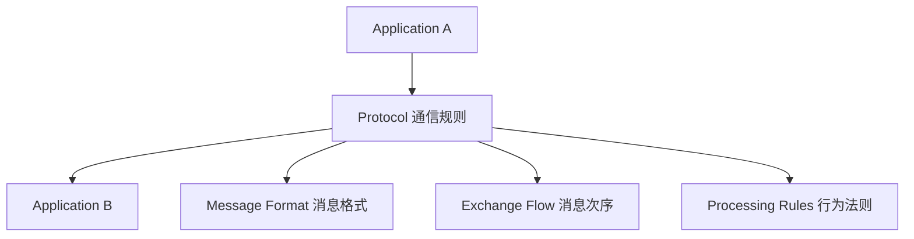
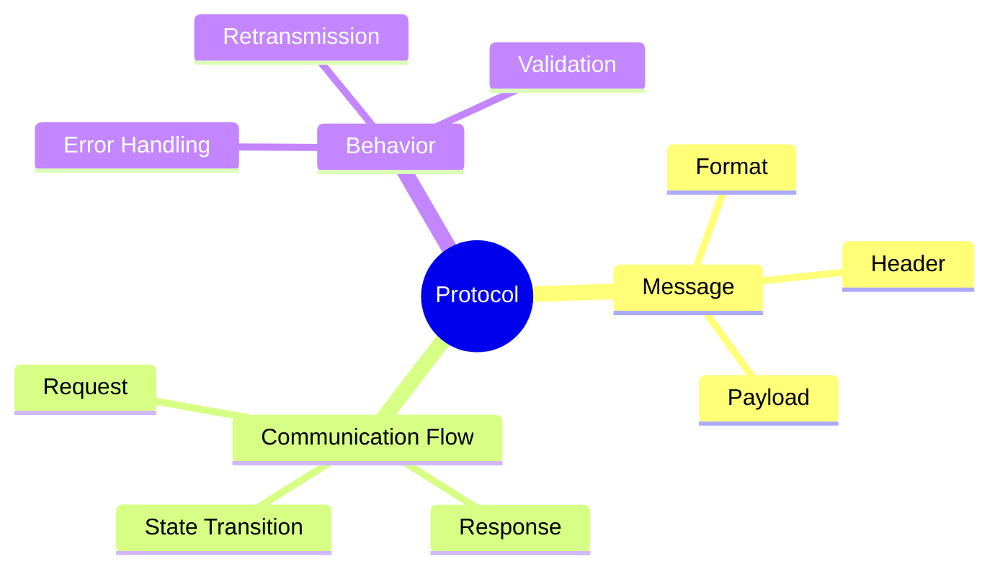

# Protocol（协议）

## Definition

Protocol 是**通信实体之间约定的数据交换规则**。

它规定：

- 消息的数据格式（Format）
- 消息交换顺序（Order）
- 收到消息后的处理行为（Action）

简单理解：

> Protocol 解决“不同系统之间如何按照共同规则交换信息”，是分布式环境中的通信契约。

---

# 系统位置 / 架构关系



---

# 核心概念思维导图



---

# 核心内容 / 分类组成

## 1. 消息格式（Message Format）

定义通信数据如何组织。

包括：

- 字段位置
- 字段长度
- 字段含义

例如 TCP Header：

- Source Port
- Destination Port
- Sequence Number
- ACK Number

---

## 2. 交换流程（Message Order）

定义消息出现的先后顺序。

例如 TCP 三次握手：

```text
SYN

SYN + ACK

ACK
```

协议不仅规定“发什么”，还规定“什么时候发”。

---

## 3. 行为规则（Processing Rules）

定义收到消息后的具体处理方式。

例如 TCP：

收到 ACK：

- 更新窗口
- 继续发送数据

超时：

- 重传

---

# 核心价值 / 作用

1. **降低通信耦合**：通信双方无需知道内部实现，只需要遵守共同协议。
2. **隐藏实现**：Java、Go、Rust 实现的服务器，只要遵守 HTTP，均可互相通信。
3. **支持系统互操作**：支持不同硬件、操作系统和编程语言之间的协同工作。

---

# 与相关概念的关系

## 与 [[Interface]] 的关系

Protocol 可以看作分布式环境中的接口定义。

区别：

| 概念 | 作用 |
| - | - |
| Interface | 定义软件组件如何调用 |
| Protocol | 定义网络实体如何交换信息 |

---

## 与 [[Abstraction]] 的关系

Protocol 是一种抽象。

它隐藏内部实现与数据处理方式，只暴露通信规则。

---

# Summary

> Protocol 是网络通信中的契约，规定数据如何表达、如何交换以及如何响应。

核心关键词：

- Communication Contract
- Message Format
- State Transition

---

# 关联概念

- [[Interface]]：接口定义
- [[Abstraction]]：抽象思想
- [[API]]：应用程序接口
- [[CS/00-Overview/Socket|Socket]]：通信端点接口
- [[CS/00-Overview/Layering|Layering]]：分层体系
