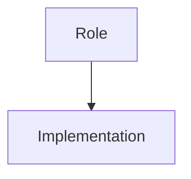
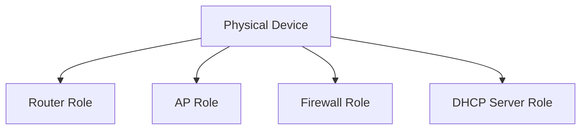
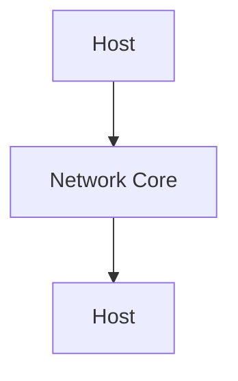
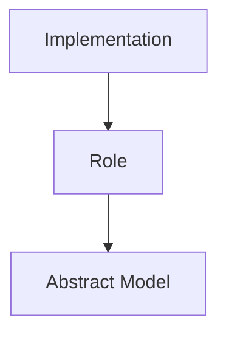

# Role vs Implementation（角色与实现）

## Definition

在计算机科学中，需要区分：

```
Role（角色）

Implementation（实现）
```

二者描述的是不同层面的概念。

- Role：系统中承担的功能职责
- Implementation：实现该功能的具体方式

简单来说：

> 角色描述“做什么”，实现描述“怎么做”。

---

# Core Idea



一个角色可以有多个实现。

一个实现也可能承担多个角色。

---

# Example: Computer Network

## Host / End System

传统理解：

```
Host = Computer
```

但是更准确：

```
Host

=

网络通信中的端点角色
```

关注：

- 是否作为数据源
- 是否作为数据目的
- 是否运行应用程序

而不是：

- 是 PC
- 是服务器
- 是手机

---

## Router

传统理解：

```
Router = 专用网络设备
```

但是实际：

Router 是一种角色：

```
Router Role

=

负责数据包转发
```

实现可以是：

```
专用路由器硬件

或者

Linux Server + IP Forwarding
```

---

# Example: Modern Devices

现代设备功能越来越复杂。

例如：

家庭路由器：



同一个设备承担多个角色。

---

# Why Not Classify by Hardware?

如果按照物理设备分类：

```
Router
AP
Host
```

会遇到问题：

- 设备功能不断融合
- 软件可以实现硬件功能
- 同一设备可能承担多个职责

因此：

```
Physical Device

≠

Network Role
```

---

# Role in Layered Model

分层模型关注的是：

```
Function

而不是

Physical Object
```

例如 Internet：



这里：

Host：

表示通信端点角色。

Network Core：

表示负责转发的网络角色。

并不要求对应固定硬件。

---

# Relationship with Abstraction

Role vs Implementation 是抽象思想的体现。

现实：

```
具体设备
```

抽象：

```
功能角色
```

模型：



---

# Common Examples

|Role|Possible Implementations|
|-|-|
|Host|PC、服务器、手机、嵌入式设备|
|Router|专用路由器、Linux Server|
|Storage|HDD、SSD、远程存储|
|Database|MySQL、PostgreSQL、SQLite|

---

# Summary

Role vs Implementation：

> 计算机系统中的概念模型通常描述功能角色，而不是固定的物理实现。

核心：

```
What it does

≠

How it is built
```

理解计算机系统时，应优先关注：

- 功能职责
- 通信关系
- 抽象模型

而不是：

- 设备名称
- 硬件形态

---

# 关联概念

- [[CS/99-Thinking Note/Role-vs-Implementation-QnA|Role-vs-Implementation 思考记录]]
- [[Abstraction]]：抽象思想
- [[Interface]]：接口定义
- [[Host-End-System]]：端系统与主机