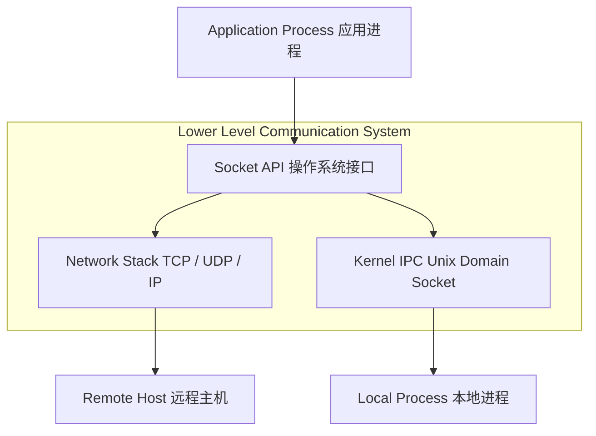
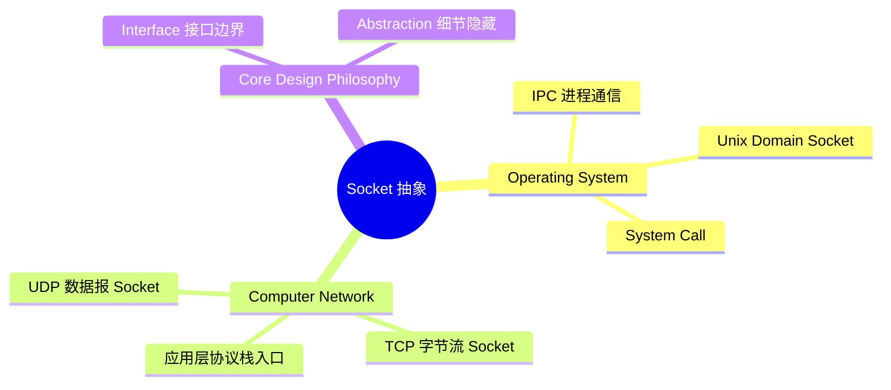

# Socket（通信端点抽象）

## Definition

Socket（套接字）是操作系统提供给应用程序的**通信端点抽象与访问接口**。

它规定 / 它负责：

- 创建与管理通信端点（Endpoint）
- 隐藏底层的具体通信实现细节
- 向应用层暴露统一的数据收发接口

简单理解：

> Socket 是应用程序使用底层通信能力（网络或本地）的公开入口，Socket ≠ Protocol。

---

# 系统位置与跨领域架构

---

# 核心概念思维导图

---

# 核心分类

## 1. Network Socket（网络套接字）

用于跨主机网络通信。

关注点：

- IP Address + Port Number 确定唯一通信端点
- 访问 TCP（字节流、可靠传输）或 UDP（数据报、无连接）

---

## 2. Unix Domain Socket（域套接字）

用于本机进程间通信（IPC）。

关注点：

- 不经过网络协议栈与网卡
- 数据直接在内核缓冲区中高效流转

---

# 核心价值 / 作用

1. **隐藏通信细节**：应用无需关心 TCP 状态机、IP 路由选择或网卡驱动。
2. **统一通信抽象**：无论是本机 IPC 还是跨国网络通信，上层均使用统一的 Socket 交互模式。
3. **解耦应用与底层**：底层通信协议可以替换或升级，而上层 Socket 调用代码保持不变。

---

# Summary

> Socket 是计算机系统中连接应用层与底层通信系统的桥梁，集中体现了 Interface（接口）与 Abstraction（抽象）的核心设计思想。

核心关键词：

- Communication Endpoint
- Interface
- Abstraction
- Network Socket & Unix Domain Socket

---

# 关联概念

- [[CS/99-Thinking Note/Socket-QnA|Socket 思考记录]]
- [[CS/Operating System/Process Management/IPC/IPC-Socket|OS IPC Socket]]
- [[CS/Computer Network/01-Application Layer/Network-Socket|CN Network Socket]]
- [[Interface]]：接口定义
- [[Abstraction]]：抽象思想
