# Interface 思考记录

## 背景

在学习不同 CS 领域概念时，发现很多概念都有类似结构：

例如：

Socket：

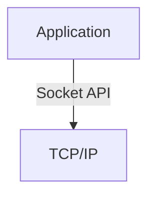

ABI：

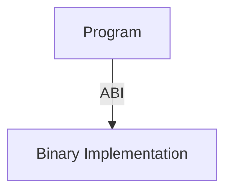

Runtime：

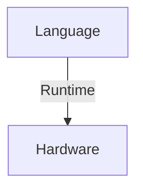

这些概念看起来属于不同领域，但是都有一个共同特点：

> 通过某种边界连接两个不同抽象层。

因此产生对 Interface 的思考。

---

# Q1：为什么计算机系统需要接口？

## 初始疑问

为什么不直接让上层使用底层实现？

例如：

应用程序直接控制：

- 网络设备
- 内存
- CPU 指令

为什么还需要：

- API
- ABI
- Socket
- System Call？

---

## 思考过程

如果上层直接依赖实现：

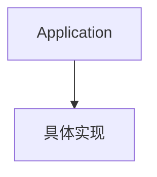

那么：

底层变化：

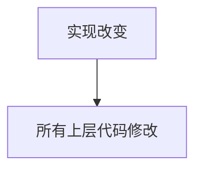

导致：

- 高耦合
- 难维护
- 难扩展

---

## 结论

需要一个稳定边界：

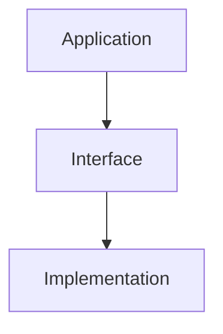

上层依赖接口，而不是实现。

---

# Q2：Interface 和 Abstraction 的区别？

## 疑问

Interface 和 Abstraction 经常一起出现。

是否是同一个概念？

---

## 思考

Abstraction 解决：

> 如何隐藏复杂性？

例如：

Socket 隐藏：

- TCP 状态
- 数据包传输
- 网络设备

---

Interface 解决：

> 隐藏之后，如何交互？

例如：

Socket 提供：

```
socket()

connect()

send()

recv()
```

---

## 结论

关系：

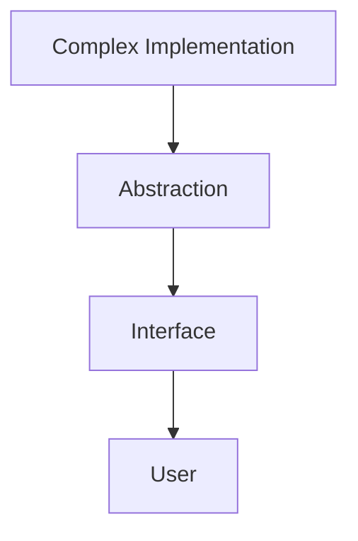

Abstraction 是思想。

Interface 是实现抽象的边界。

---

# Q3：为什么 Socket 可以看作 Interface？

## 疑问

Socket 是网络概念还是操作系统概念？

---

## 思考

如果从网络看：

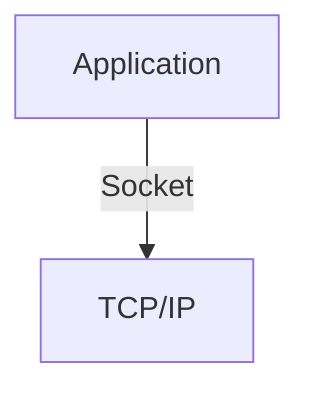

Socket 是应用访问网络的入口。


如果从 OS 看：

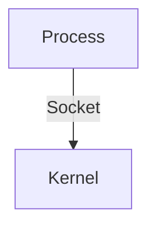

Socket 是操作系统提供的通信接口。

---

## 结论

Socket 的本质不是网络协议。

而是：

> 应用程序与通信系统之间的接口。

---

# Q4：为什么 ABI 可以看作 Interface？

## 疑问

ABI 和 Socket 完全不是一个领域。

为什么感觉类似？

---

## 思考

ABI：

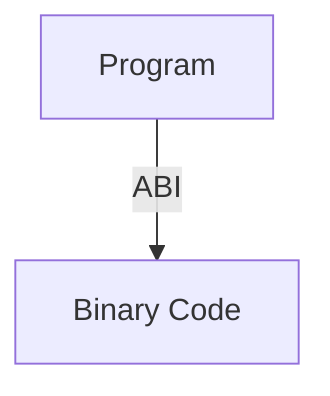

解决：

不同编译单元如何交互。


Socket：

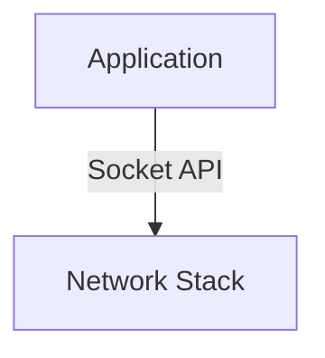

解决：

应用如何访问通信能力。


共同点：

- 定义交互规则
- 隐藏内部实现
- 保持兼容性

---

## 结论

ABI 和 Socket 都属于 Interface。

区别：

|概念|连接对象|
|-|-|
|ABI|程序与程序|
|Socket|应用与通信系统|

---

# Q5：Interface 为什么能够支持多种实现？

## 疑问

为什么同一个接口可以有不同实现？

例如：

Socket：

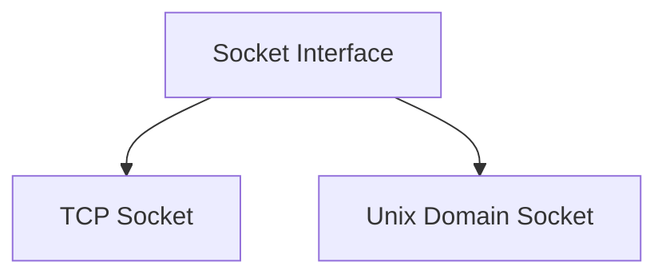

---

## 思考

如果上层依赖具体实现：

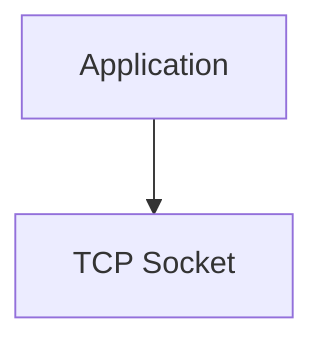

那么无法替换。

如果依赖接口：

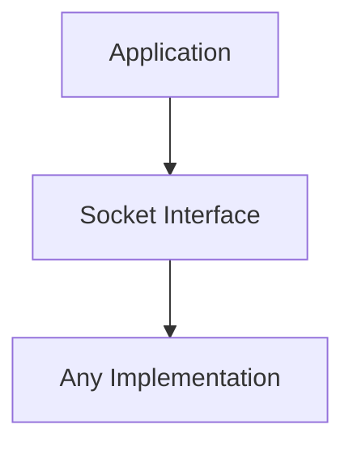

实现可以变化。

---

## 结论

Interface 提供：

- 实现替换能力
- 扩展能力
- 降低依赖

---

# Q6：Interface 是否就是 API？

## 疑问

很多时候 Interface 和 API 混用。

是否等价？

---

## 思考

API：

```
Application Programming Interface
```

主要描述：

程序调用接口。


但是 Interface 范围更大：

包括：

- API
- ABI
- Hardware Interface
- Protocol Interface

---

## 结论

关系：

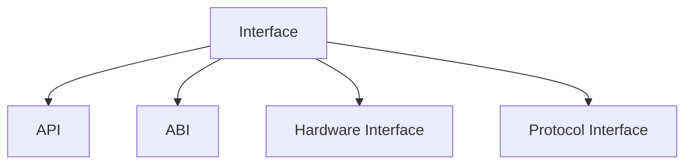

API 是 Interface 的一种。

---

# Q7：为什么计算机科学大量使用 Interface？

## 思考

计算机系统不断增加复杂度：

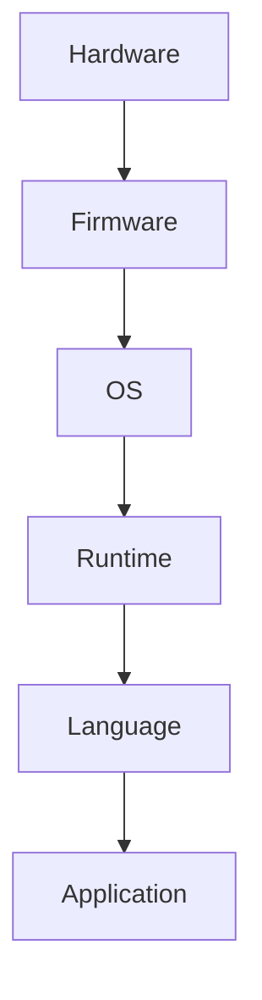

如果每一层直接依赖下一层实现：

系统无法发展。

因此每层提供：

```
Interface
```

作为边界。

---

## 最终理解

计算机科学的发展过程：

不是不断消除复杂性。

而是：

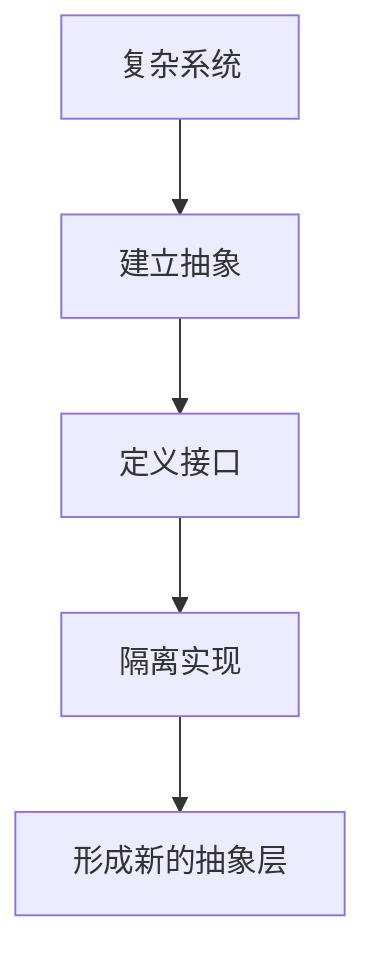

---

# 总结模型

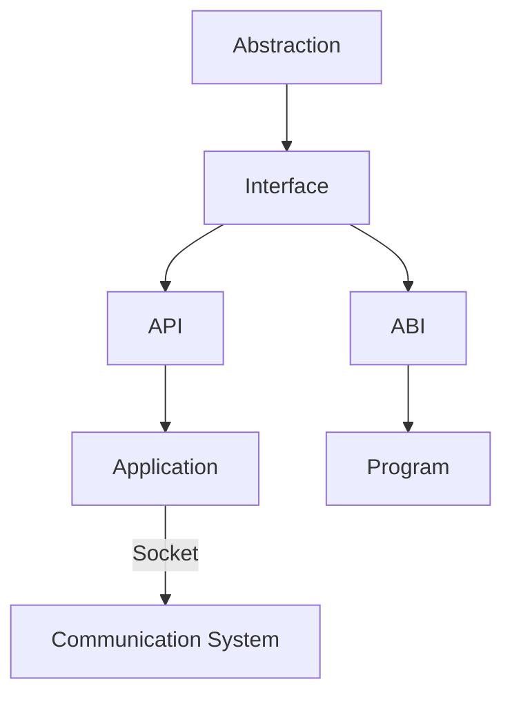

核心理解：

> Interface 是抽象落地后的边界，是不同系统、模块、层次之间进行协作的契约。

---

# 关联概念

- [[CS/00-Overview/Interface|Interface 概念概览]]
- [[Abstraction]]：抽象思想
- [[API]]：应用程序编程接口
- [[ABI]]：应用程序二进制接口
- [[CS/00-Overview/Socket|Socket]]：通信端点接口