# Layering 思考记录

## 背景

在学习 Computer Network 时接触到网络分层模型：

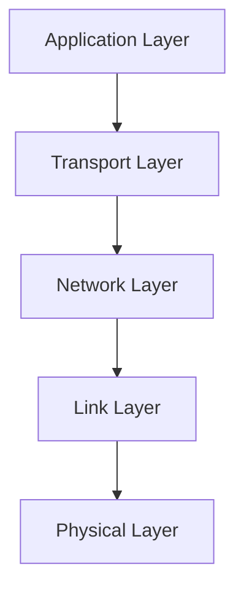

同时在其他领域也发现类似结构：

操作系统：

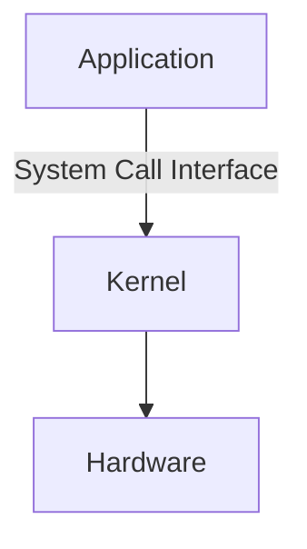

编程语言：

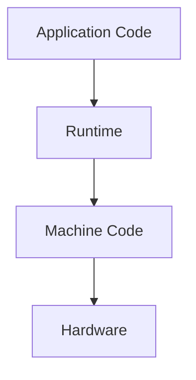

因此产生疑问：

为什么计算机系统喜欢分层？

---

# Q1：为什么需要分层？

## 初始疑问

为什么不直接让应用程序访问底层？

例如：

应用程序直接操作：

- 网卡
- CPU
- 内存
- 磁盘

是否更直接？

---

## 思考过程

如果没有分层：

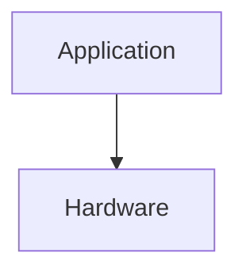

应用程序需要了解：

- 硬件细节
- 通信协议
- 资源管理方式

导致：

- 复杂度巨大
- 不同硬件无法兼容
- 修改成本高

---

## 结论

分层通过增加抽象边界降低复杂度。

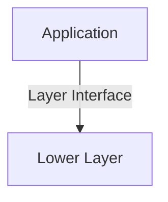

---

# Q2：分层和抽象是什么关系？

## 疑问

分层是不是另一种抽象？

---

## 思考

抽象：

关注：

> 隐藏什么细节？

例如：

Socket 隐藏 TCP/IP 实现。

---

分层：

关注：

> 如何组织多个抽象？

例如：

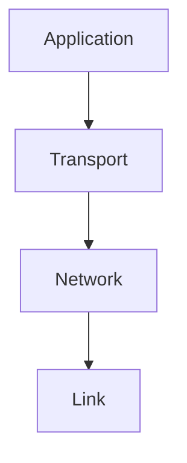

每一层：

- 使用下一层服务
- 向上一层提供接口

---

## 结论

关系：

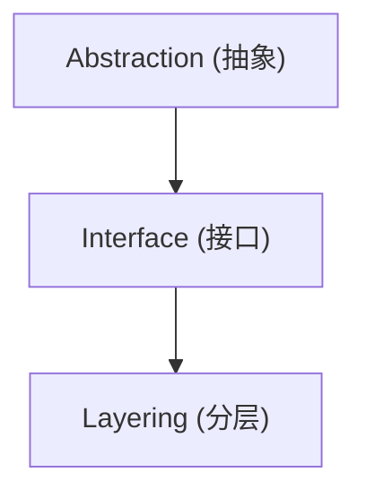

抽象产生层。

接口连接层。

---

# Q3：为什么每层只关心自己的职责？

## 疑问

为什么 TCP 不需要知道网卡如何工作？

为什么应用程序不用知道 IP 如何路由？

---

## 思考

每层都有自己的责任：

Application：

```
用户需求
```

Transport：

```
进程间通信
```

Network：

```
主机间通信
```

Link：

```
链路传输
```

---

## 结论

分层原则：

> 每一层只依赖下一层提供的服务，而不关心具体实现。

---

# Q4：分层是否完全隔离？

## 疑问

既然分层隐藏细节，上层是否永远不用了解底层？

---

## 思考

正常情况：

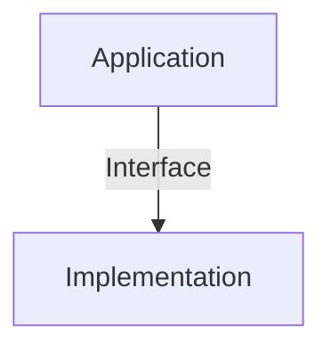

但是：

性能问题时：

- 延迟
- 内存
- 网络质量

需要了解底层行为。

例如：

开发高性能网络程序时，需要理解：

- TCP 拥塞控制
- 内核缓冲区
- 网络延迟

---

## 结论

抽象不是消除底层。

而是默认隐藏底层。

必要时可以穿透抽象。

---

# Q5：为什么网络模型不是严格物理结构？

## 疑问

Internet 是否真的按照：


分开实现？

---

## 思考

现实设备可能同时包含：

- 路由功能
- 防火墙
- NAT
- AP

硬件边界和模型边界不同。

---

## 结论

分层描述的是：

```
功能角色

=
逻辑结构
```

不是：

```
物理设备结构
```

---

# Q6：分层有什么优点？

## 1. 降低复杂度

每层只处理自己的问题。

---

## 2. 易于替换实现

例如：

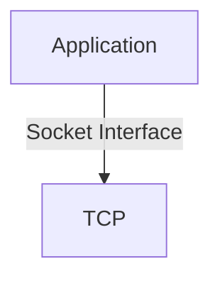

可以替换：

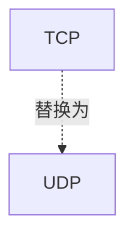

上层接口不变。

---

## 3. 促进标准化

不同厂商实现只需要遵守接口。

---

# 最终理解

分层（Layering）：

> 将复杂系统拆分为多个具有明确职责的抽象层，每层通过接口与其他层交互，从而降低复杂度并支持独立演进。

---

# 核心模型

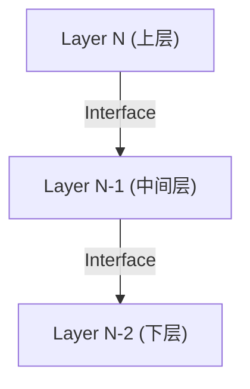

每层：

- 提供服务
- 使用服务
- 隐藏实现