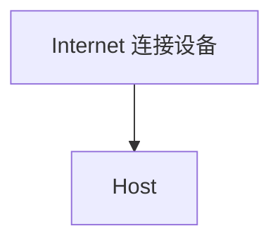
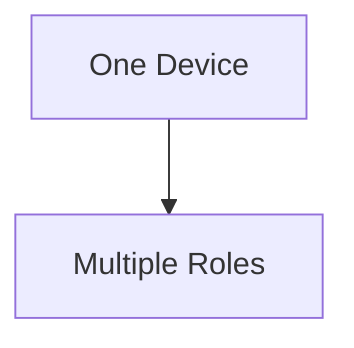
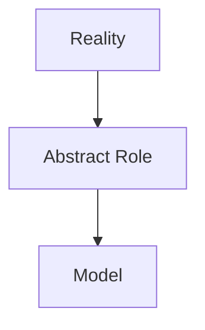

# Role vs Implementation 思考记录

## 背景

在学习 Computer Network 的 Host / End System 时，遇到一个问题：

教材描述：

> All devices connected to the Internet are called hosts or end systems.

如果按照字面理解：



会产生很多问题。

例如：

- Router 是否也是 Host？
- Switch 是否也是 Host？
- AP 是否也是 Host？

因为这些设备同样：

- 连接 Internet
- 参与数据通信
- 拥有网络接口

---

# Q1：为什么不能按照物理设备划分网络角色？

## 初始疑问

如果：

```
Host = 某种设备
Router = 某种设备
AP = 某种设备
```

那么现代网络设备会很难分类。

例如：

家庭路由器：

```
一个物理设备

同时具有：

Router
AP
Firewall
DHCP Server
```

那么它到底是什么？

---

## 思考过程

问题在于：

把：

```
物理设备
```

和：

```
网络角色
```

混淆了。

计算机网络模型描述的是：

```
功能职责
```

而不是：

```
硬件形态
```

---

## 结论

```
Physical Device

≠

Network Role
```

---

# Q2：Host 到底是什么？

## 疑问

如果 Host 不是设备，那么 Host 是什么？

---

## 思考

Host 的关键不是：

- 一台电脑
- 一个服务器
- 一个手机

而是：

是否承担：

```
Communication Endpoint
```

角色。

也就是：

- 作为数据源
- 作为数据目的
- 运行应用程序

---

## 结论

Host 是网络中的角色。

不是固定硬件。

例如：

```
PC

可以是 Host

```

```
Cloud Server

可以是 Host
```

```
Embedded Device

也可以是 Host
```

---

# Q3：Router 为什么不是 Host？

## 疑问

Router：

- 有 IP 地址
- 连接 Internet
- 处理数据包

为什么不是 Host？

---

## 思考

区别不在于：

```
有没有网络能力
```

而在于：

```
承担什么职责
```

Host：

```
Source / Destination
```

Router：

```
Forwarding
```

---

## 结论

Router 不是因为“不是设备”。

而是：

在当前网络模型中，它承担的是：

```
Packet Forwarding Role
```

---

# Q4：同一个设备可以有多个角色吗？

## 疑问

如果角色不是设备，那么一个设备是否可以同时具有多个角色？

---

## 思考

现实设备：

```
Linux Server
```

可以：

运行 Web 服务：

```
Host Role
```

开启 IP Forwarding：

```
Router Role
```

运行防火墙：

```
Firewall Role
```

---

## 结论



角色取决于功能，而不是设备名称。

---

# Q5：为什么学习计算机系统不能局限于硬件？

## 疑问

计算机教材经常使用：

- 主机
- 路由器
- 交换机

这些硬件词汇。

但是现实系统越来越复杂：

- 软件定义网络
- 虚拟化
- 云计算
- 容器网络

是否应该脱离硬件理解？

---

## 思考

硬件可以帮助理解：

例如：

```
Router

≈

负责转发数据包的设备
```

但是不能作为严格定义。

因为：

实现方式会变化。

---

## 结论

学习抽象模型时：

优先关注：

```
Function

Communication Relationship

Responsibility
```

而不是：

```
Physical Object
```

---

# Q6：Role vs Implementation 和 Abstraction 的关系

## 思考

为什么计算机科学大量使用这种区分？

因为现实系统非常复杂。

如果直接描述：

```
具体实现
```

模型会被限制。

因此需要：



---

# 最终理解

计算机科学中的很多概念：

不是描述：

```
这个东西是什么
```

而是描述：

```
这个东西承担什么作用
```

例如：

```
Host

不是：

某种电脑

而是：

通信端点角色
```

```
Router

不是：

某种盒子

而是：

数据转发角色
```

---

# 核心结论

```
Role ≠ Implementation
```

或者：

```
What it does

≠

How it is implemented
```

理解 CS 中的抽象模型时：

应该先理解：

- 角色
- 职责
- 关系

再理解：

- 硬件
- 软件
- 具体实现