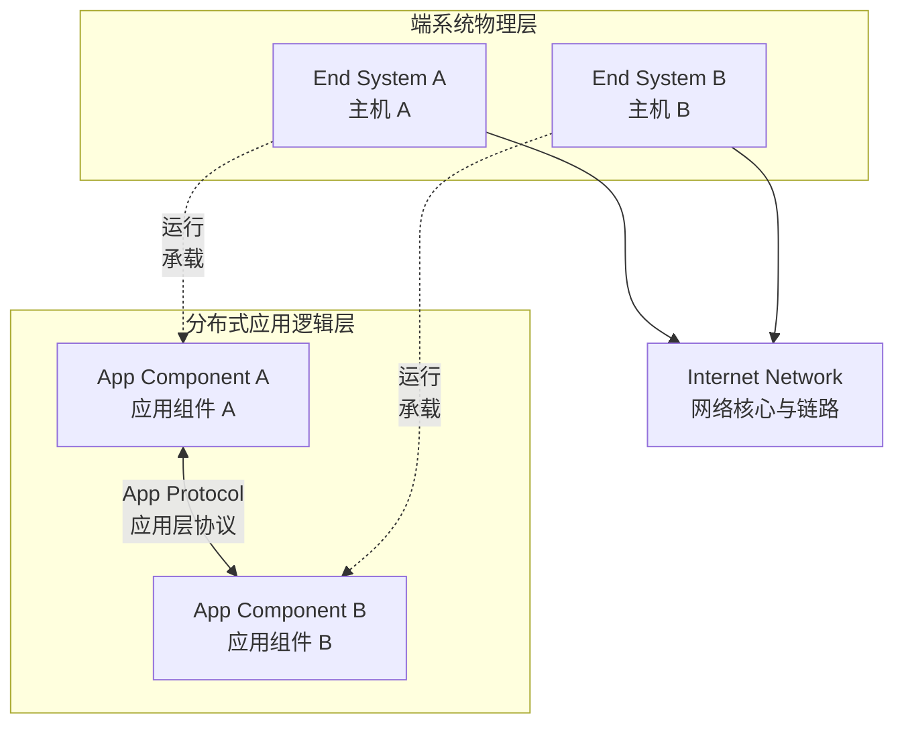
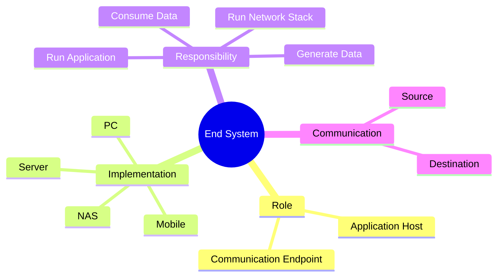

# Host-and-End-System（主机 / 端系统）

## Definition

Host / End System 是**运行应用程序，并作为网络通信最终数据来源或目的地的系统**。

它负责：

- 产生数据
- 消费数据
- 运行网络应用

简单理解：

> End System 关注“谁参与通信”，而不是“什么设备”。

---

# 系统位置 / 架构关系

---

# 核心概念思维导图

---

# 核心内容 / 分类组成

## 1. 应用端点（Application Endpoint）

End System 运行具体的应用进程，如 Browser、Web Server、Database、IoT 应用。

---

## 2. 数据端点（Data Endpoint）

通信中的发送者（Source）与接收者（Destination）都是 End System。

---

# 核心价值 / 作用

1. **明确通信主体**：清晰区分“谁产生/消费数据”与“谁转发数据”。
2. **建立 Internet Edge 抽象**：互联网边缘为 End Systems，互联网核心为 Routers。

---

# 与相关概念的关系

## 与 [[CS/Computer Network/00-Overview/Router|Router]] 的关系

区别：

| 端点类型 | 核心职责 | 系统位置 |
| - | - | - |
| End System | 产生/消费数据，运行应用 | 网络边缘（Network Edge） |
| Router | 转发 Packet 数据包 | 网络核心（Network Core） |

---

# Summary

> End System 是互联网通信的最终参与者，是应用运行和数据产生消费的位置。

核心关键词：

- Application Endpoint
- Network Edge
- Data Source/Destination

---

# 关联概念

- [[CS/Computer Network/00-Overview/Router|Router]]
- [[CS/Computer Network/00-Overview/Internet|Internet 架构概览]]
- [[CS/Computer Network/99-Thinking Note/Host-End-System-QnA|Host / End System 思考记录]]
- [[CS/00-Overview/Role-vs-Implementation|Role vs Implementation]]
