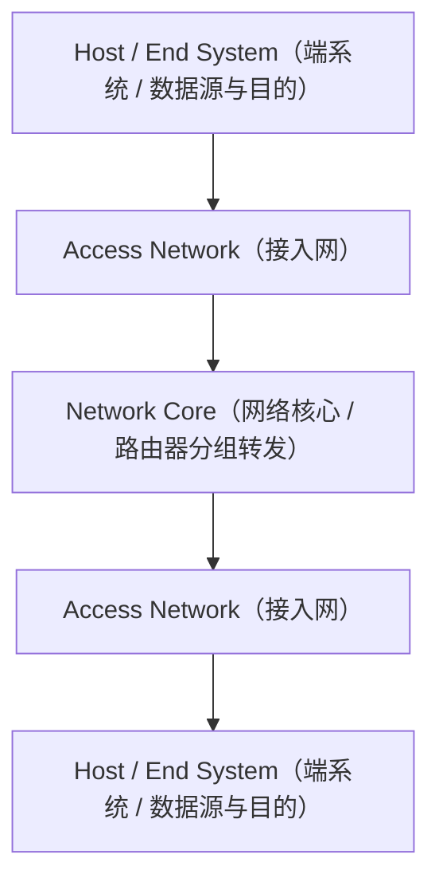

# Internet（因特网/互联网架构概览）

## Definition

Internet（因特网）是由全球无数互相连接的计算机网络与节点构成的**逻辑网际互联体系**。

它规定 / 它负责：

- 统一使用 TCP/IP 协议栈进行通信
- 通过网络核心（Network Core）进行分组（Packet）转发
- 为运行在端系统（Host）上的分布式应用提供通信支持

简单理解：

> Internet 不是单一的物理网络，而是通过统一协议与接口连接各种异构网络的“网络的网络”。

---

# 系统架构与抽象模型

Internet 在逻辑上抽象为网络边缘与网络核心：

---

# 核心组成维度

## 1. Network Edge（网络边缘）

包含所有的 Host / End System（如 PC、服务器、智能终端）。

关注点：

- 运行网络应用程序（Application Process）
- 作为数据通信的源（Source）与目的（Destination）端点
- 实现端到端（End-to-End）协议栈

---

## 2. Network Core（网络核心）

由相互连接的路由器（Router）和链路（Link）构成的网网状结构。

关注点：

- 分组交换（Packet Switching）与路由转发
- 不运行高层应用逻辑

---

# 核心价值

1. **异构网络互联**：通过 IP 协议屏蔽底层以太网、Wi-Fi、光纤等不同物理链路细节。
2. **端到端通信**：使全球任意两台 Host 上的应用进程能够相互通信。

---

# Summary

> Internet 集中体现了分层（Layering）与接口（Interface）思想，通过统一的 IP 协议与分组交换，实现了全球异构计算系统的无缝互联。

核心关键词：

- Host & End System
- Network Core & Packet Switching
- TCP/IP Stack
- Interconnection

---

# 关联概念

- [[CS/Computer Network/00-Overview/Host-End-System|Host-End-System]]：端系统与主机
- [[CS/00-Overview/Layering|Layering]]：分层机制
- [[CS/00-Overview/Interface|Interface]]：接口定义
- [[CS/00-Overview/Socket|Socket]]：通信端点接口
