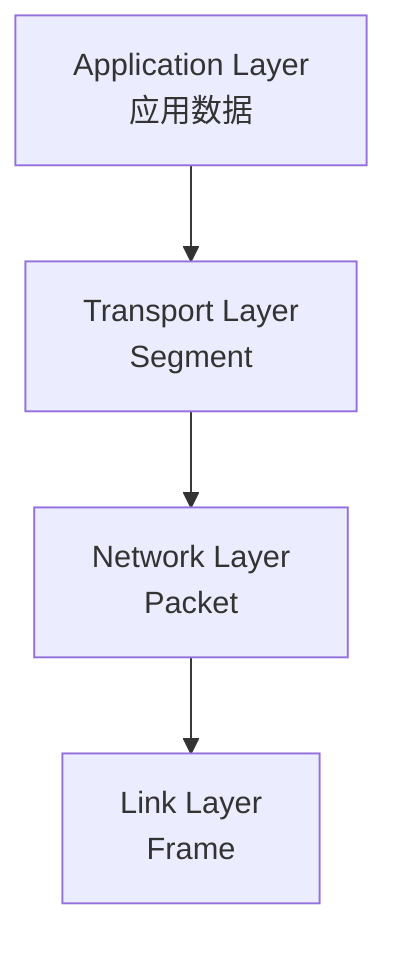
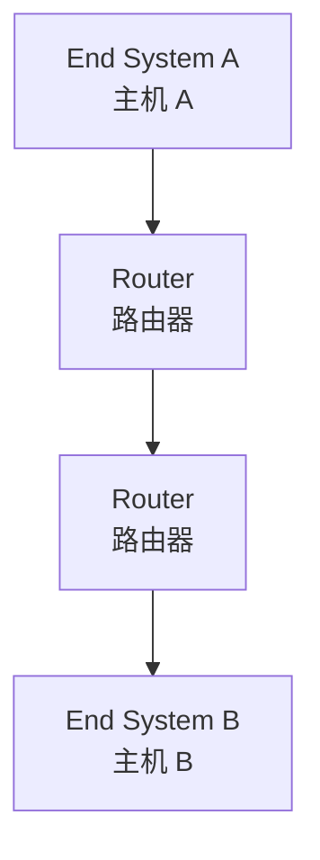
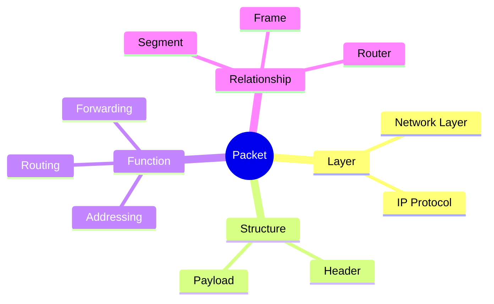
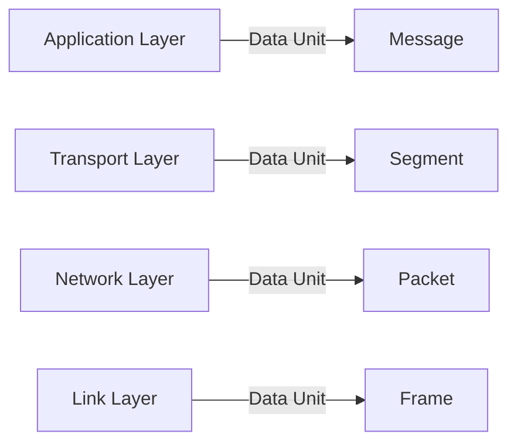
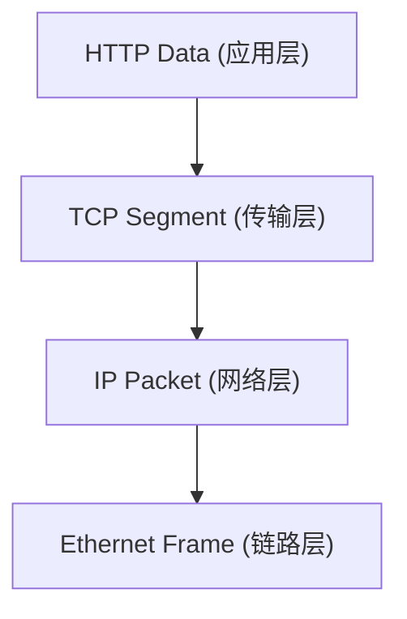
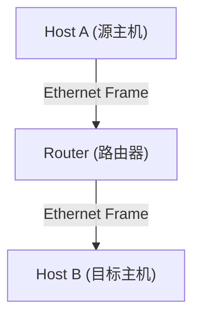
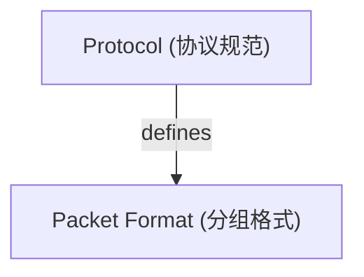
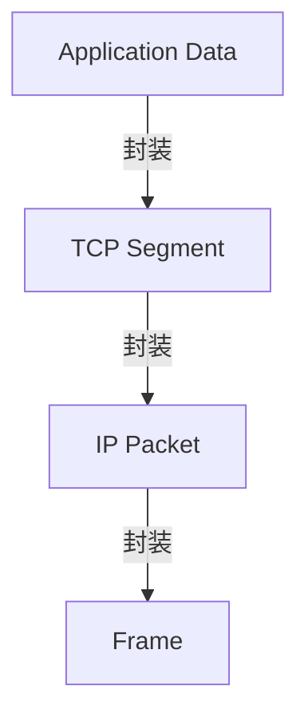

# Packet（分组）

## Definition

Packet 是**网络层中用于传输数据的基本数据单元**，由网络层协议定义，用于在网络中从一个端系统传递到另一个端系统。

它规定：

- 数据在网络层中的组织形式
- 网络寻址所需的信息
- 数据在网络中的转发方式

简单理解：

> Packet 是网络层视角下的数据载体，是端系统之间通过网络交换信息的基本单位。

---

# 系统位置 / 架构关系



在互联网体系中：



Router 处理的核心对象：

```text
Packet
```

而不是：

```text
Application Data
```

---

# 核心概念思维导图



---

# 核心内容 / 分类组成

## 1. Packet 是网络层的数据单位

在分层网络模型中，不同层有不同的数据单位：



Packet 是：

> 网络层看到的数据对象。

---

例如：

应用发送：

```text
HTTP Request
```

经过 TCP：

```text
TCP Segment
```

经过 IP：

```text
IP Packet
```

经过 Ethernet：

```text
Ethernet Frame
```

过程：



---

## 2. Packet 的组成

通常：

```mermaid
flowchart TB
    subgraph Packet ["Network Packet"]
        direction TB
        Header["Network Header (头部)"]
        Payload["Payload (负载)"]
        Header --- Payload
    end
    
    style Header fill:var(--highlight),stroke:var(--secondary),stroke-width:2px
```

其中：

### Header

包含网络层控制信息。

例如 IPv4 Header：

- Source IP
- Destination IP
- TTL
- Protocol

作用：

告诉网络：

- 数据来自哪里
- 要去哪里
- 如何处理

---

### Payload

Packet 携带的实际数据。

例如：


IP 层并不关心：

- HTTP 内容
- JSON 格式
- 用户数据

它只负责：

> 把 Payload 送到目标地址。

---

# 3. Packet 与 Router 的关系

Router 的主要职责：


Router：

读取：

```text
Destination IP
```

查找：

```text
Routing Table
```

决定：

```text
Next Hop
```

然后转发 Packet。

---

因此：

```text
Host:
生成 / 消费 Packet

Router:
转发 Packet
```

---

# 4. Packet 与 Segment 的关系

容易混淆：

```text
Segment ≠ Packet
```

区别：

| 概念 | 所属层 | 作用 |
| - | - | - |
| Segment | Transport Layer | 进程间通信 |
| Packet | Network Layer | 主机间通信 |

关系：

```mermaid
flowchart TB
    subgraph IP_Packet ["IP Packet (网络层)"]
        direction TB
        Header["IP Header (头部)"]
        Payload["TCP Segment (传输层负载)"]
        Header --- Payload
    end
    
    style Header fill:var(--highlight),stroke:var(--secondary),stroke-width:2px
```

即：

Packet 的 Payload 可以是 Segment。

---

# 5. Packet 与 Frame 的关系

区别：

| 概念 | 所属层 | 范围 |
| - | - | - |
| Packet | 网络层 | 端到端 |
| Frame | 链路层 | 单段链路 |

例如：



Packet 在整个路径保持逻辑连续：

```mermaid
flowchart LR
    subgraph 逻辑视角 (端到端)
    P_A["Host A"] -->|Packet| P_B["Host B"]
    end
    
    subgraph 物理视角 (逐跳)
    F_A["Host A"] -->|Frame| F_R["Router"]
    F_R -->|Frame| F_B["Next Hop / Host B"]
    end
```

---

# 核心价值 / 作用

1. **实现跨网络通信**

Packet 提供：

- 全局地址
- 路由信息

使不同网络能够互联。

2. **实现网络层抽象**

上层不用关心：

- 经过多少路由器
- 使用什么链路

只需要：

```text
发送 Packet 到目标 IP
```

3. **支持分组交换（Packet Switching）**

网络不需要提前建立固定线路。

多个 Packet 可以：

- 独立选择路径
- 动态转发

---

# 与相关概念的关系

## 与 [[CS/00-Overview/Protocol|Protocol]] 的关系

Packet 是协议定义的数据结构。

例如：

IP Protocol 定义：

```text
IP Packet Format
```

包括：

- Header
- Address
- Control Field

关系：



---

## 与 Encapsulation（封装） 的关系

Packet 是封装过程中的产物。

过程：



---

## 与 [[CS/Computer Network/00-Overview/Router|Router]] 的关系

Router 处理 Packet。

关系：


---

## 与 [[CS/Computer Network/00-Overview/Host-End-System|Host-and-End-System]] 的关系

Host：

负责产生和接收 Packet。

Router：

负责中间转发 Packet。

---

# Summary

> Packet 是网络层定义的数据传输单元，它携带地址和控制信息，使数据能够通过多个网络节点从一个 End System 到达另一个 End System。

核心关键词：

- Network Layer Data Unit
- IP Address
- Routing
- Forwarding

---

# 关联概念

- [[CS/00-Overview/Protocol|Protocol]]：定义 Packet 的格式和处理规则
- [[CS/Computer Network/00-Overview/Host-End-System|Host-and-End-System]]：Packet 的产生者和接收者
- [[CS/Computer Network/00-Overview/Router|Router]]：Packet 的转发者
- Encapsulation（封装）：解释 Packet 如何形成
- Segment（报文段）：Packet 携带的传输层数据
- Frame（帧）：Packet 在链路层的封装形式
- MTU（最大传输单元）：限制 Packet 最大大小的机制
