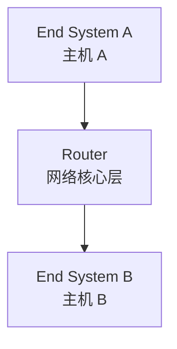
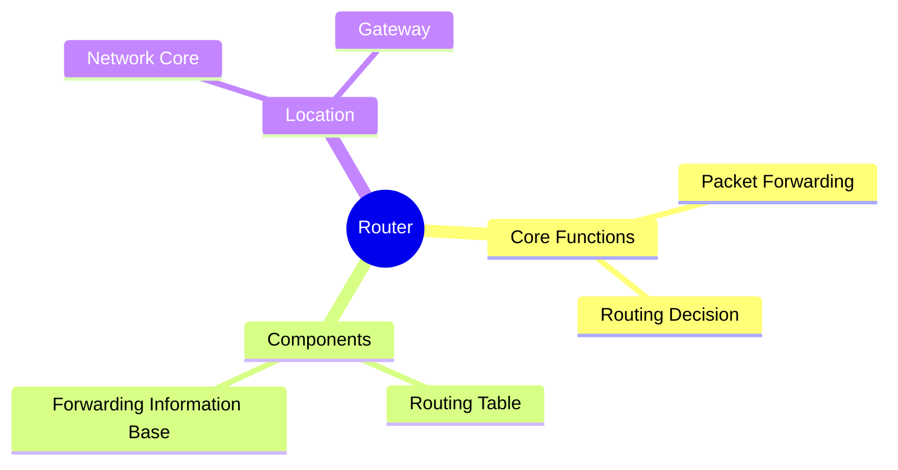

# Router（路由器）

## Definition

Router 是**负责在不同网络之间转发 Packet 的网络核心层设备/组件**。

它负责：

- 查看网络层 Header
- 根据路由表选择路径
- 转发数据包（Packet Forwarding）

简单理解：

> Router 是连接不同网络的十字路口，负责指引数据包走向最终目的地。

---

# 系统位置 / 架构关系

---

# 核心概念思维导图

---

# 核心内容 / 分类组成

## 1. 路由器功能（Router Function）

负责：

- Packet forwarding（数据包转发）
- Routing decision（路由路径选择）

---

# 核心价值 / 作用

1. **连接异构网络**：屏蔽底层链路层差异（如 Ethernet 与 Wi-Fi 之间的互通）。
2. **构建 Network Core**：通过路由协议互相连接，构成整个互联网的骨干转发网络。

---

# 与相关概念的关系

## 与 [[CS/Computer Network/00-Overview/Host-End-System|Host-and-End-System]] 的关系

区别：

| 节点类型 | 核心职责 | 系统位置 |
| - | - | - |
| Router | 转发 Packet 数据包，连接网络 | 网络核心（Network Core） |
| End System | 产生/消费数据，运行应用 | 网络边缘（Network Edge） |

---

# Summary

> Router 是计算机网络中负责寻找路径并转发数据包的核心节点，是互联网的交通枢纽。

核心关键词：

- Packet Forwarding
- Routing Table
- Network Core

---

# 关联概念

- [[CS/Computer Network/00-Overview/Host-End-System|Host-and-End-System]]
- [[CS/00-Overview/Role-vs-Implementation|Role vs Implementation]]
- [[CS/Computer Network/00-Overview/Internet|Internet 架构概览]]
