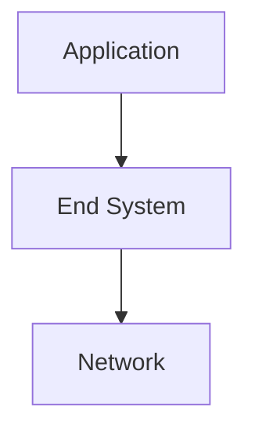
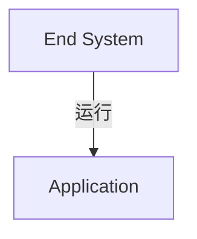
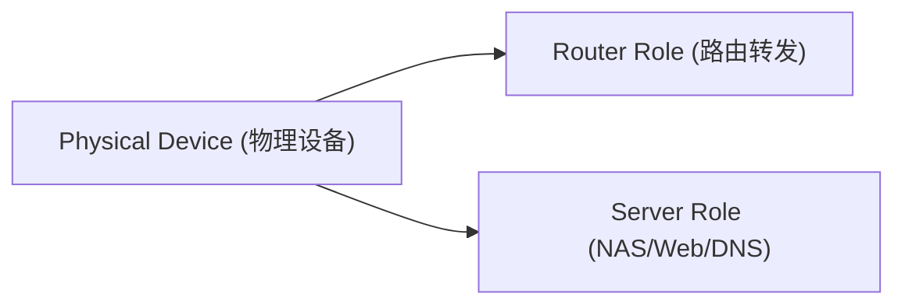
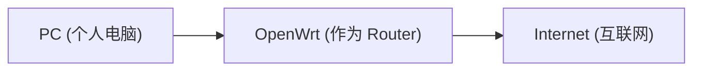
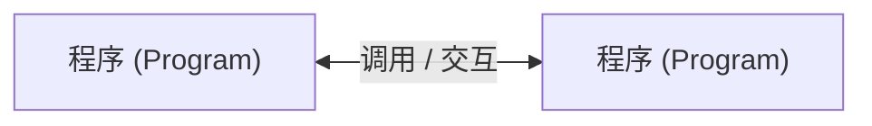
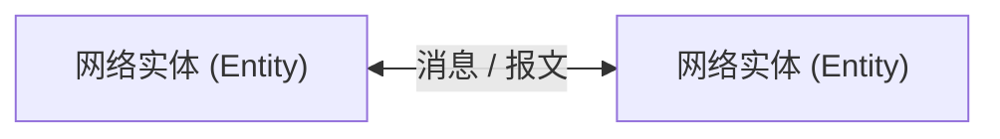
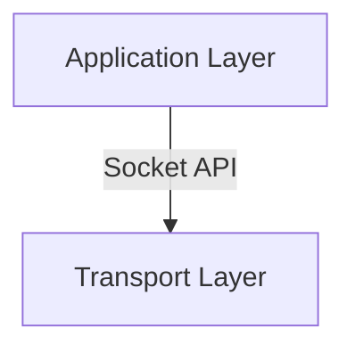
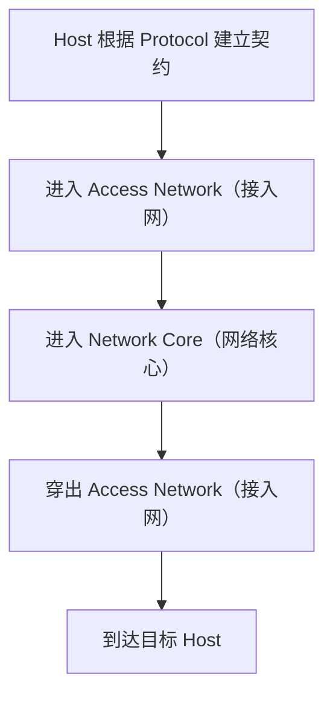
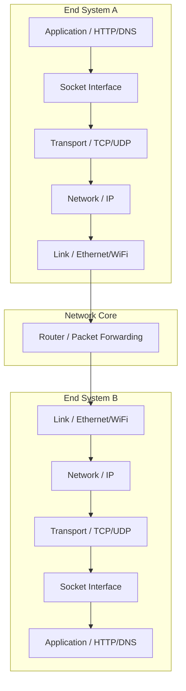

# Network Fundamentals（计算机网络核心要素）思考记录

## 背景

学习《Computer Networking: A Top-Down Approach》时，遇到多个概念：

- Host / End System
- Router
- Packet
- Protocol
- Socket
- MTU

发现国内教材中很多概念被拆散描述，容易形成：

```text
TCP 是 TCP
IP 是 IP
HTTP 是 HTTP
路由是路由
```

但是不知道这些概念为什么组合成互联网通信体系。

因此尝试从“通信双方如何交换信息”这个角度重新理解计算机网络。

---

# Q1：为什么网络需要 Host / End System 这个概念？

## 初始疑问

国内教材更多使用：

- 主机
- 节点
- 设备

而《自顶向下》中大量使用：

- Host
- End System

疑问：

为什么不用“节点”描述？

为什么强调 End System？

---

## 思考过程

直觉理解：

```text
网络 = 很多设备连接起来

设备之间传输数据
```

但是这个模型忽略了：

- 谁产生数据？
- 谁消费数据？
- 谁运行应用？

进一步抽象：

互联网不是单纯设备互联，而是：



网络存在的目的：

不是让设备互相连接，而是让运行在不同端系统上的应用交换数据。

因此 Host / End System 关注：

```text
通信的最终参与者
```

而不是：

```text
物理设备
```

---

## 结论

Host / End System：

> 指运行应用程序，并作为通信最终端点参与数据交换的系统。

核心：



---

# Q2：Router 和 Host 是互斥关系吗？

## 初始疑问

路由器负责转发数据。

如果 OpenWrt 同时提供：

- NAS
- Web
- DNS

它到底是不是 Host？

---

## 思考过程

直觉理解：

```text
设备类型决定身份

路由器 = Router
服务器 = Host
```

问题：

现代设备并不是单一功能。

OpenWrt：



角色取决于通信场景。

场景 1：转发流量



OpenWrt 承担 `Router Role`，执行路由、转发、NAT。

场景 2：访问 NAS

```text
PC → SMB → OpenWrt
```

OpenWrt 承担 `Host / End System` 角色，运行应用、消费请求、返回数据。

---

## 结论

Host 和 Router 不是设备分类，而是：

> 网络通信中的角色。

同一个设备可以同时具有多个角色。

---

# Q3：什么是 Protocol（协议）？

## 初始疑问

协议是不是只定义数据格式？

---

## 思考过程

直觉理解：

```text
协议 = 报文格式
```

但这并不完整。

例如 TCP，不仅规定 Header 结构，还规定：

- 如何建立连接
- 如何确认数据
- 如何重传
- 如何关闭连接

因此协议包含：

```text
Protocol

├── Message Format（消息格式）
│
├── Message Order（消息顺序）
│
└── Processing Rule（处理规则）
```

---

## 结论

协议：

> 通信双方为了正确交换信息而约定的一套规则。

类似：

```text
Protocol = Communication Contract（通信契约）
```

---

# Q4：协议和 API 有什么关系？

## 初始疑问

为什么 API 和 Protocol 感觉类似？

---

## 思考过程

API：



定义：输入、输出、调用方式。

Protocol：



定义：数据格式、交换流程、行为规则。

二者本质都是接口约定。

区别：

```text
API: 软件接口

Protocol: 通信接口
```

---

## 结论

协议可以理解为：

> 分布式环境下的接口定义。

---

# Q5：为什么数据有 Message、Segment、Packet、Frame？

## 初始疑问

为什么同一个数据有这么多名字？

---

## 思考过程

不同协议层关注的问题不同。同一份数据经过不同层，会增加不同控制信息。

模型：

```text
Application  → Message
Transport    → Segment
Network      → Packet
Link         → Frame
Physical     → Bits
```

---

## 结论

数据名称表示：

> 当前所在协议层看到的数据单元（PDU）。

---

# Q6：Header 是什么？

## 初始疑问

中文翻译“首部”感觉非常奇怪。

---

## 思考过程

Header 本质不是“头”，它是：

> 协议为了控制通信附加的元数据区域。

例如：

TCP Header 包含：Port, Sequence Number, ACK, Flags。

IP Header 包含：Source IP, Destination IP, TTL。

---

## 结论

Header 是描述数据如何被处理的元数据信息，不是普通载荷数据（Payload）。

---

# Q7：Socket 是什么？

## 初始疑问

为什么 Socket 翻译成“套接字”？

---

## 思考过程

Socket 原意：插座、接口、连接点。

网络中 Socket 是：

> 应用程序访问网络协议栈的公开接口。

模型：



---

## 结论

Socket 不是数据，不是协议，而是：

> 应用和网络通信系统之间的接口。

---

# Q8：MTU 不一致怎么办？

## 初始疑问

如果通信路径中 MTU 不一致，怎么办？是不是协商最高速度？

---

## 思考过程

网络路径：

```text
A (MTU 9000) ─── Router (MTU 1500) ─── B (MTU 9000)
```

真正的限制不是两端，而是路径中最小 MTU：

```text
Path MTU = 路径最小 MTU (1500)
```

另外 TCP 会通过 MSS（Max Segment Size）避免产生过大的 TCP 数据。

---

## 结论

MTU 问题不是速度协商，而是：

> 确定数据包大小不能超过路径承载能力瓶颈。

---

# Q9：为什么早期协议漏洞很多？

## 初始疑问

协议如果是规则，有人不遵守规则造成攻击怎么办？

---

## 思考过程

早期 Internet 建立在“参与者可信”的假设上，目标是“互联 + 可用”。

后来出现的典型漏洞：

- **TCP**：SYN Flood（利用 TCP 连接状态机）
- **DNS**：DNS Cache Poisoning（缺少身份验证）
- **IP**：IP Spoofing（源地址缺少认证）
- **ARP**：ARP Spoofing（默认信任响应）

安全模型演化：

```text
早期：默认可信

现代：默认不信任
```

---

## 结论

现代协议设计从“能通信”发展为“通信 + 身份认证 + 完整性保护 + 权限控制”。

---

# Q10：互联网的宏观通信架构是怎样的？

## 初始疑问

Host、Router、Packet、Protocol 这些概念，在一次典型的跨网络通信中是如何串联起来的？

---

## 思考过程

可以将整个通信过程拆解为三个物理核心区域与两个逻辑要素。

一次典型的宏观通信过程：



在这个过程中：

1. **Host** 是通信的起点和终点。
2. **Access Network** 负责把 Host 连上互联网（如家里的 Wi-Fi、基站）。
3. **Network Core** 负责在茫茫网络中进行寻路和接力转发（由无数的 Router 组成）。
4. **Protocol** 贯穿始终，是所有实体能够互相听懂对方说话的共同契约。
5. **Packet** 是网络层在这个宏观架构里流转的最小原子数据单位。

---

## 结论

互联网的宏观通信可以精简为一句话：

> **Host 根据 Protocol 建立契约，通过 Access Network 进入 Network Core 与其他 Host 进行通信；在这个过程中，网络层负责路由和转发的基本单位就是 Packet。**

---

# 最终理解

> 计算机网络的本质，是让运行在不同 End System 上的应用，通过一组分层协议，在不可信、异构的网络环境中可靠交换信息。

---

# 总结模型



角色总结：

```text
End System: 产生/消费数据，运行应用
Router:     转发 Packet 数据包
Protocol:   规定通信规则与契约
Socket:     应用访问网络协议栈的接口
Packet:     网络层传输数据单元
```

---

# 关联概念

- [[CS/Computer Network/00-Overview/Host-End-System|Host / End System 概览]]
- [[CS/Computer Network/00-Overview/Internet|Internet 架构概览]]
- [[CS/00-Overview/Socket|Socket 概念概览]]
- [[CS/00-Overview/Role-vs-Implementation|Role vs Implementation]]
- [[CS/00-Overview/Interface|Interface 接口与契约]]
- [[CS/00-Overview/Layering|Layering 分层架构]]
- [[CS/00-Overview/Abstraction|Abstraction 抽象思想]]
