# Packet（分组）思考记录

## 背景

学习《Computer Networking: A Top-Down Approach》时，遇到 Packet 这个概念。

教材描述：

> 当一个端系统向另一个端系统发送数据时，发送端系统将数据分段，并为每段加上首部字节，由此形成的信息包就是 packet。

产生疑问：

- Packet 到底是什么？
- 为什么中文翻译成“分组”？
- Header 为什么会出现在 Packet 里面？
- Packet 和 Segment、Frame 的区别是什么？
- 如果 MTU 不一致，Packet 如何传输？

---

# Q1：Packet 是什么？

## 初始疑问

直觉理解：

```text
Packet = 一段数据
```

或者：

```text
Packet = 数据 + Header
```

但是这个理解不完整。

因为：

- TCP 有 Segment
- Ethernet 有 Frame
- IP 有 Packet

为什么同一份数据有多个名字？

---

## 思考过程

首先区分：

网络不是只看一份数据，而是按照协议层处理数据。

不同层有自己的数据单位：

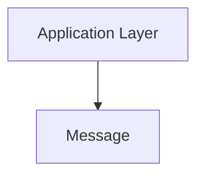

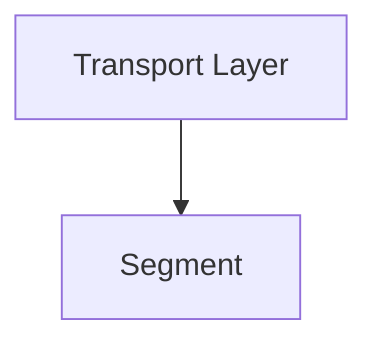

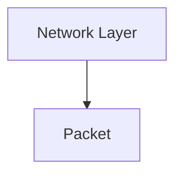

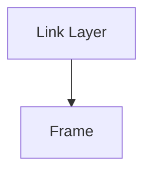

因此：

Packet 不是所有数据的统称。

它是：

> 网络层看到的数据对象。

进一步：

应用数据：

```text
HTTP Request
```

经过传输层：

```text
TCP Segment
```

经过网络层：

```text
IP Packet
```

经过链路层：

```text
Ethernet Frame
```

---

## 结论

Packet：

> 是网络层协议定义的数据传输单元，用于在不同网络之间传递数据。

---

# Q2：为什么需要 Packet？

## 初始疑问

为什么不直接发送完整数据？

为什么需要分成 Packet？

---

## 思考过程

互联网不是一条固定线路。

例如：

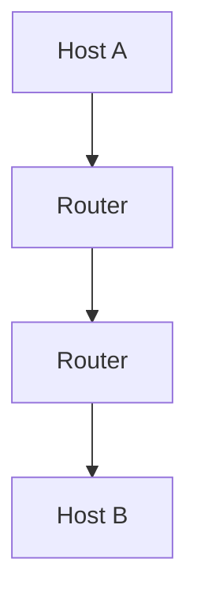

数据需要经过多个网络设备。

如果整个数据作为一个整体：

问题：

- 网络资源占用时间长
- 出错需要重新发送全部数据
- 无法灵活选择路径

因此采用：

```text
Packet Switching
```

即：

把数据拆成多个 Packet。

每个 Packet 可以：

- 独立转发
- 独立排队
- 共享网络资源

---

## 结论

Packet 是分组交换网络的基础。

它让互联网可以：

- 高效利用链路
- 支持多用户共享
- 动态选择路径

---

# Q3：Packet 和 Segment 的区别？

## 初始疑问

教材说：

> 数据分段后形成 Packet

但是 TCP 又叫 Segment。

是不是同一个东西？

---

## 思考过程

两个概念属于不同层：

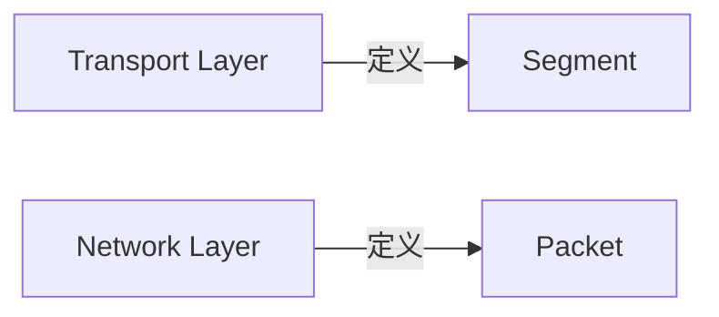

关系：

```mermaid
flowchart TB
    subgraph IP_Packet ["IP Packet (网络层)"]
        direction TB
        Header["IP Header (头部)"]
        Payload["TCP Segment (传输层负载)"]
        Header --- Payload
    end
    
    style Header fill:var(--highlight),stroke:var(--secondary),stroke-width:2px
```

即：

Packet 可以携带 Segment。

---

## 结论

```text
Segment:
传输层数据单位

Packet:
网络层数据单位
```

区别：

| 概念 | 关注 |
| - | - |
| Segment | 进程之间通信 |
| Packet | 主机之间通信 |

---

# Q4：Packet 和 Frame 的区别？

## 初始疑问

链路层也有数据包。

为什么不都叫 Packet？

---

## 思考过程

因为两个概念关注范围不同。

Packet：

关注：

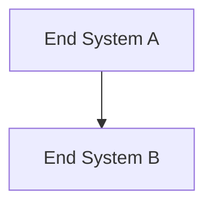

是端到端。

Frame：

关注：

```text
当前这一段链路
```

例如：

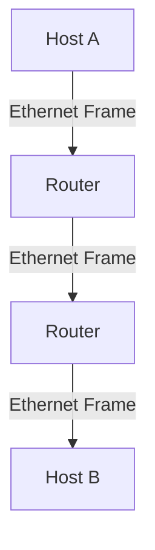

Packet：

始终保持：

```text
A → B
```

Frame：

每经过一个 Router，都会重新封装。

---

## 结论

Packet：

> 网络层端到端的数据单位。

Frame：

> 链路层单段传输的数据单位。

---

# Q5：Router 为什么处理 Packet？

## 初始疑问

Router 是怎么知道数据往哪里发送的？

---

## 思考过程

Router 不关心：

- HTTP 内容
- 用户数据

它主要读取：

```text
IP Header
```

例如：

```text
Destination IP
```

然后：

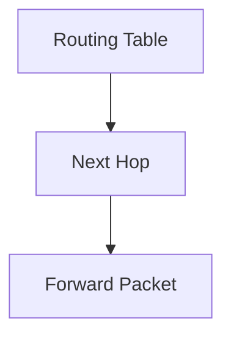

---

## 结论

Router 的核心职责：

> 根据 Packet 中的网络层信息进行转发。

---

# Q6：MTU 和 Packet 有什么关系？

## 初始疑问

如果两个设备 MTU 不一样：

例如：

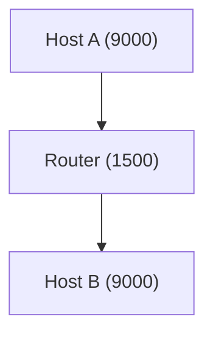

Packet 怎么传输？

是不是双方协商最高传输速度？

---

## 思考过程

MTU：

不是速度。

它表示：

> 单次链路允许承载的最大 Packet 大小。

实际限制：

```text
Path MTU = 路径中最小 MTU
```

例如：

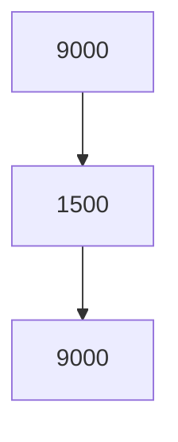

那么：

```text
Path MTU = 1500
```

TCP 会通过 MSS 调整数据大小。

---

## 结论

MTU 决定：

> Packet 最大允许大小。

不是双方速度协商。

---

# Q7：TTL 字段的本意与现实？

## 初始疑问

TTL（Time To Live）设计本意是为了让每一层 Router 根据转发 Packet 耗费的时间来减去对应的秒数吗？
但是现在它是不是已经失去了 Time To Live 的意义，变成了每经过一个节点就固定减 1？

---

## 思考过程

确实如此。

1981 年的 IPv4 标准（RFC 791）中：

> TTL 的单位最初设定为“秒”。

设计初衷是：
报文在网络中最多存活这么长时间。如果 Router 处理耗时 1 秒，就减去 1；如果很快，标准规定“哪怕不到 1 秒，也必须强制减 1”。

现实演化：
随着硬件发展，现代 Router 转发 Packet 只需要几微秒。如果按时间减，根本减不动；要求 Router 精确计算排队耗时也会带来巨大开销。

因此，现代路由器的做法统一退化为：

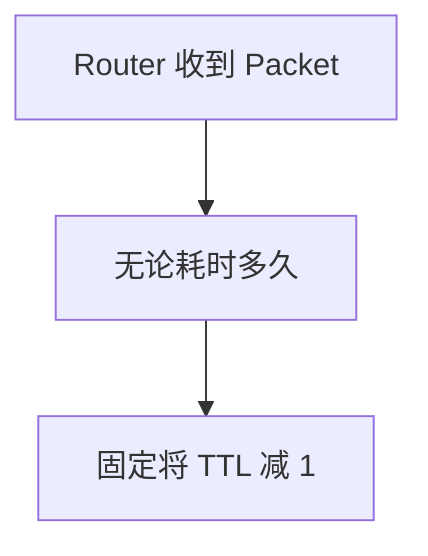

---

## 结论

TTL 在现代网络中完全失去了“时间”的作用，实质上物理功能已经退化成了：

> Hop Limit（最大跳数限制）

它的唯一作用是：防止 Packet 在路由环路中无限期死循环。
这也正是为什么在 IPv6 中，该字段被正式更名为 `Hop Limit`。

---

# 最终理解

> Packet 是网络层协议定义的数据单元，它承载上层数据，并通过 IP 地址和路由机制，在多个网络节点之间从一个 End System 传递到另一个 End System。

---

# 总结模型

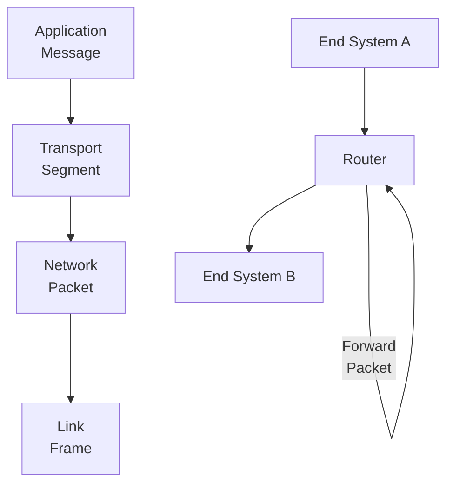

核心关系：

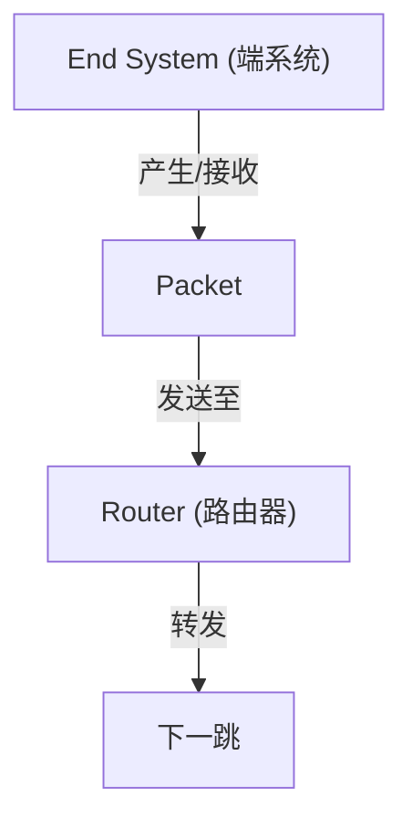

这个流转模型将前面拆解的各个节点直接连接在了一起，它也是《自顶向下》中建立 Internet Architecture 时的核心抽象逻辑：

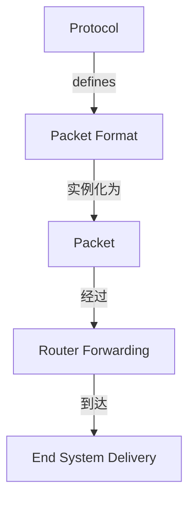

---

# 关联概念

- [[CS/00-Overview/Protocol|Protocol]]：定义 Packet 的格式和处理规则
- [[CS/Computer Network/00-Overview/Host-End-System|Host-and-End-System]]：Packet 的最终通信端点
- [[CS/Computer Network/00-Overview/Router|Router]]：Packet 的转发角色
- Encapsulation（封装）：解释 Packet 如何形成
- Segment（报文段）：Packet 携带的传输层数据
- Frame（帧）：Packet 在链路层的封装形式
- MTU（最大传输单元）：限制 Packet 最大大小的机制
