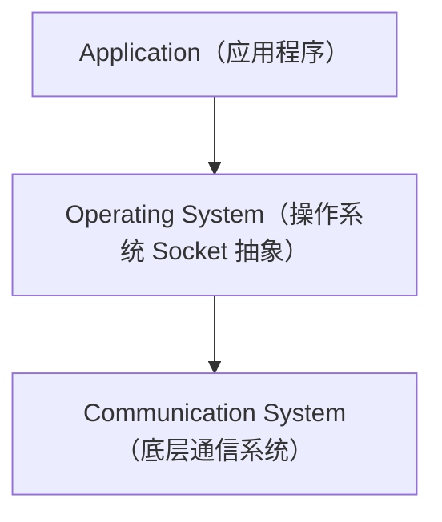
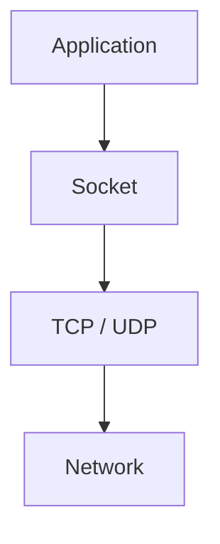
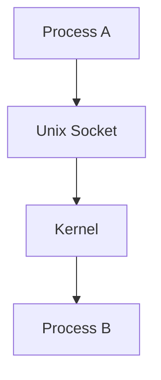

# OS Socket（进程通信接口抽象）

## Definition

Socket 是操作系统提供给应用程序的通信接口抽象。

它不是协议，而是应用程序访问底层通信能力的公开入口。

---

# 系统位置



应用程序通过 Socket 使用底层通信能力。

---

# 核心类型

## 1. Network Socket（网络套接字）

用于跨主机网络通信。



---

## 2. Unix Domain Socket（域套接字）

用于本机进程间通信（IPC）。



---

# Socket 与 Protocol 的关系

```text
Socket ≠ Protocol
```

Socket 提供统一访问接口，TCP/UDP 等底层协议负责具体的传输控制与通信规则。

---

# Summary

> Socket 是操作系统向应用暴露的通信接口抽象，隐藏底层网络协议栈与内存流转细节。

---

# 关联概念

- [[CS/00-Overview/Socket|Socket 概念概览]]
- [[CS/99-Thinking Note/Socket-QnA|Socket 思考记录]]
- [[CS/Computer Network/01-Application Layer/Network-Socket|CN Network Socket]]
- [[Interface]]：接口定义
- [[Abstraction]]：抽象思想