# Runtime（运行时）

## Definition

Runtime（运行时）指程序执行时所依赖的环境和支持系统。

它负责：

- 提供程序执行所需能力
- 管理程序运行状态
- 连接程序代码与底层系统

简单理解：

> Runtime 是程序从“代码”变成“正在运行的程序”之间的执行环境。

---

# Runtime 在程序执行中的位置

一个程序通常不是直接运行：

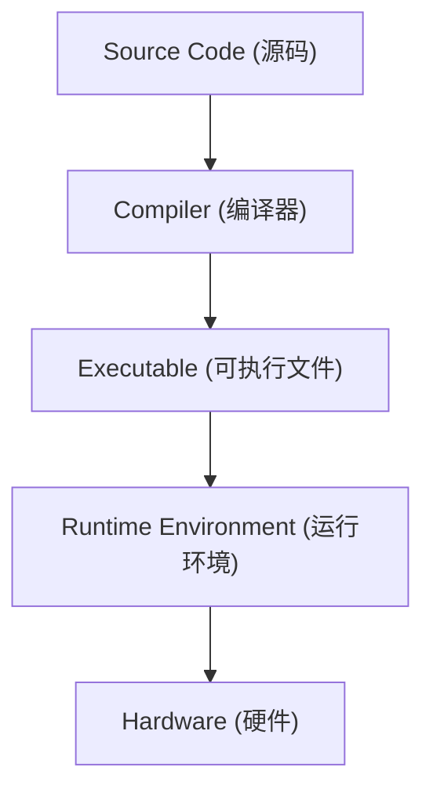

Runtime 位于程序和底层系统之间。

---

# 初始疑问

## Q1：是否存在完全没有 Runtime 的语言？

### 疑问

很多资料会说：

- C 没有 Runtime
- Rust 没有 Runtime

是否意味着：

```
No Runtime

=

直接运行在硬件上
```

---

## 思考

程序最终都需要：

- CPU 执行指令
- 内存管理
- 系统调用
- 输入输出

因此：

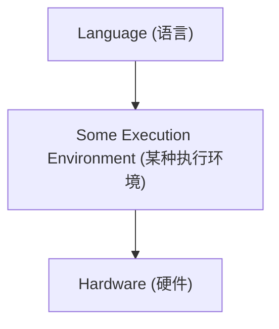

无法完全脱离运行环境。

---

## 结论

严格来说：

不存在绝对“没有 Runtime”的语言。

区别不是：

```
有 Runtime

vs

没有 Runtime
```

而是：

```
Runtime 的大小和职责不同
```

---

# Runtime 的不同形式

## C Runtime

C 的 Runtime 相对较小。

通常包括：

- 程序启动代码
- 基础库支持
- 内存分配
- 系统调用封装

特点：

```
接近操作系统
```

因此容易被认为：

```
C ≈ 无 Runtime
```

但实际上仍然存在运行支持。

---

## Java Runtime

Java：

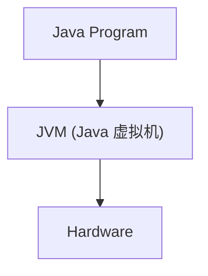

Runtime：

- 字节码执行
- 垃圾回收
- 类加载
- 内存管理

特点：

Runtime 较重。

---

## Go Runtime

Go：

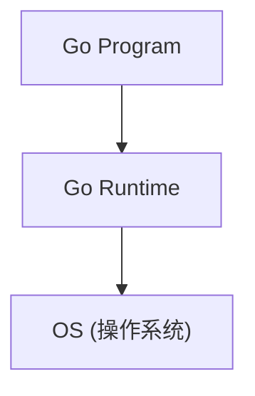

Runtime 提供：

- Goroutine 调度
- GC
- 内存管理

---

## Rust Runtime

Rust 通常没有类似 JVM 的大型 Runtime。

但是仍然存在：

- 标准库支持
- 启动代码
- Panic 处理
- 内存分配机制

因此：

```
Rust Runtime 较小

≠

没有 Runtime
```

---

# Q2：为什么不同语言需要不同 Runtime？

## 思考

不同语言提供不同抽象。

例如：

Java：

抽象：

```
Managed Memory
```

需要：

```
GC Runtime
```

Go：

抽象：

```
Lightweight Thread
```

需要：

```
Scheduler Runtime
```

C：

抽象：

```
接近机器
```

Runtime 需求较少。

---

## 结论

Runtime 的存在取决于：

语言希望提供多少高级能力。

---

# Q3：Runtime 和操作系统是什么关系？

## 疑问

Runtime 是否等于操作系统？

---

## 思考

不是。

层次：

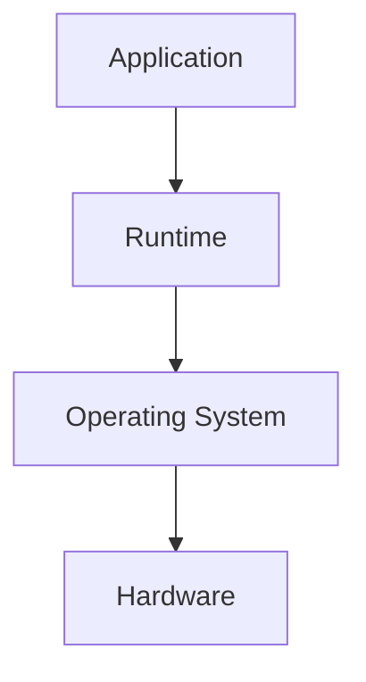

Runtime 建立在 OS 之上。

例如：

Go Runtime 调度 Goroutine：

但是最终线程仍由 OS 提供。

---

## 结论

Runtime：

- 利用 OS 能力
- 提供语言级抽象

---

# Q4：Runtime 和 Abstraction 的关系

## 思考

Runtime 本质也是一种抽象层。

例如：

操作系统：

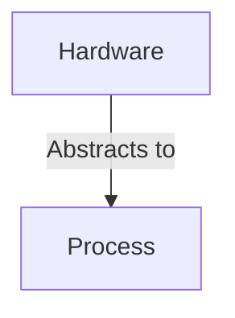

语言 Runtime：

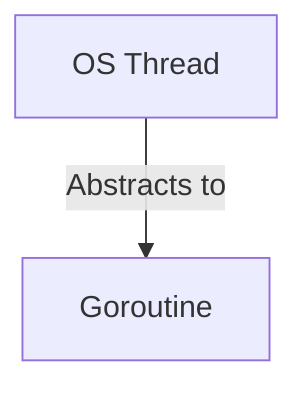

Runtime 隐藏底层细节。

---

## 结论

Runtime 是具体领域中的抽象实现。

关系：

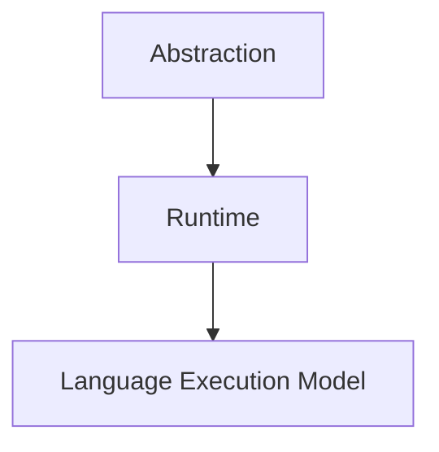

---

# Q5：Runtime 和 Interface 的关系

## 思考

Runtime 也提供接口。

例如：

程序调用：

```
new()

print()

spawn()
```

实际上可能依赖：

```
Runtime Implementation
```

---

## 结论

Runtime 也是一种执行层接口。

---

# Runtime 与硬件的关系

错误理解：

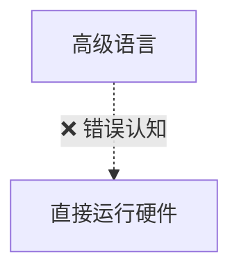

更准确：

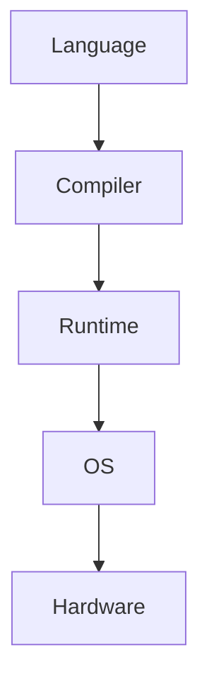

不同语言只是 Runtime 所处位置和复杂度不同。

---

# 总结

Runtime：

> 程序执行过程中提供必要支持能力的运行环境，是连接语言抽象与底层系统的重要层。

核心理解：

```
没有 Runtime

×

绝对不存在


Runtime 不同

√

形式和复杂度不同
```

---

# 关联概念

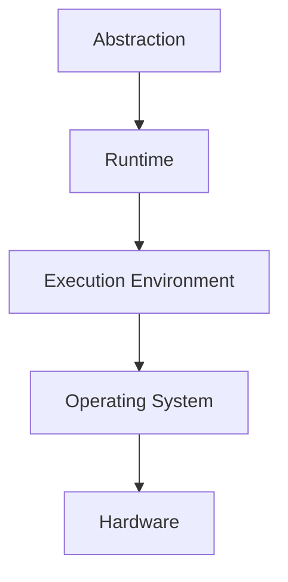

Runtime 是语言设计、编译器和操作系统之间的交叉概念。