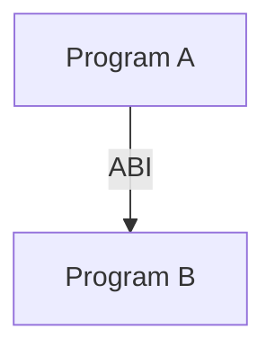
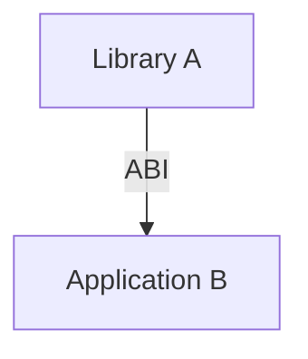
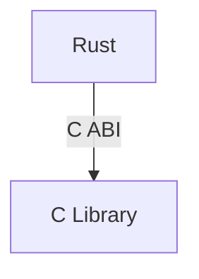
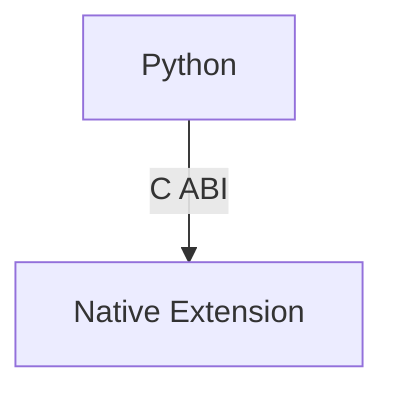
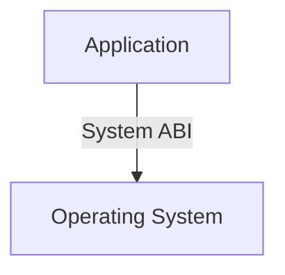
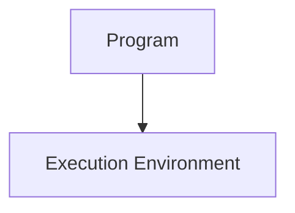
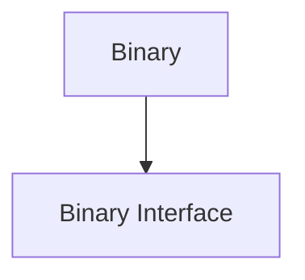
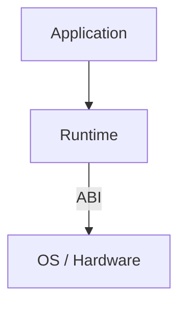
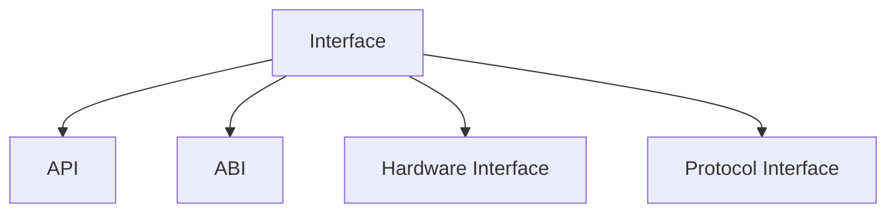

# ABI（Application Binary Interface）

## Definition

ABI（Application Binary Interface，应用程序二进制接口）定义了**已编译程序之间进行交互时的二进制级约定**。

它规定：

- 二进制代码如何调用其他代码
- 数据如何表示
- 函数如何传递参数
- 程序如何链接和加载

简单理解：

> API 解决“源码如何调用”，ABI 解决“机器码如何交互”。

---

# ABI 与 API 的区别

## API

API（Application Programming Interface）面向程序员。

例如：

```c
printf("hello");
```

关注：

- 函数名称
- 参数类型
- 返回值

属于源码层面的接口。

---

## ABI

ABI 面向编译后的程序。

例如：



关注：

- 参数放寄存器还是栈
- 返回值位置
- 数据结构内存布局
- 符号名称规则

属于二进制层面的接口。

---

# ABI 包含的内容

## 1. Calling Convention（调用约定）

规定函数调用方式。

例如：

函数：

```c
int add(int a, int b);
```

需要约定：

参数：

```
a 放哪里？
b 放哪里？
```

返回值：

```
放哪个寄存器？
```

栈：

```
谁负责清理？
```

---

## 2. Data Layout（数据布局）

规定数据在内存中的表示。

例如：

结构体：

```c
struct User {
    int id;
    char name[32];
};
```

需要约定：

- 字段顺序
- 对齐方式
- 大小

否则不同语言无法正确访问。

---

## 3. Symbol Naming（符号规则）

规定编译后的函数名称。

例如：

源码：

```c
void hello();
```

可能生成：

```
hello
```

而 C++：

```cpp
void hello(int);
```

可能生成：

```
_Z5helloi
```

因为需要支持函数重载。

---

## 4. Binary Format（二进制格式）

规定可执行文件和库的结构。

例如：

- ELF
- PE
- Mach-O

用于：

- 加载
- 链接
- 动态库调用

---

# ABI 的作用

## 1. 支持模块组合

例如：



不同模块可以独立编译。

---

## 2. 支持跨语言调用

例如：





---

## 3. 保持二进制兼容

如果 ABI 不变：

旧程序可以继续运行。

例如：

操作系统保持 ABI：



应用无需重新编译。

---

# 为什么 C ABI 很常见？

C ABI 成为事实标准主要因为：

## 1. C 语言模型简单

C：

- 类型系统简单
- 数据布局直接
- 调用规则清晰

容易被其他语言实现。

---

## 2. Runtime 较小

C 通常依赖：

- 操作系统
- 标准库

没有复杂语言 Runtime。

---

## 3. 工具链支持广泛

几乎所有主流语言都可以：

```
extern "C"
```

调用 C 接口。

---

# ABI 与 Runtime 的关系

两者处于不同层次。

Runtime：



负责：

- 内存管理
- 调度
- GC
- 异常处理

ABI：



负责：

- 调用规则
- 数据交换
- 链接

关系：



---

# ABI 与 Interface 的关系

ABI 是 Interface 的一种。

关系：



ABI 特点：

- 面向二进制
- 面向编译后程序
- 面向系统兼容

---

# Summary

ABI：

> 定义二进制程序之间交互规则的接口标准，使不同模块、不同语言、不同编译产物能够协同运行。

核心关键词：

- Binary Interface
- Calling Convention
- Data Layout
- Linking
- Compatibility
- Cross-language Interoperability