# API（Application Programming Interface）

## Definition

API（Application Programming Interface，应用程序接口）是程序之间进行交互的接口。

它定义：

- 可以调用什么功能
- 如何调用
- 输入输出是什么

简单理解：

> API 是程序使用其他程序或系统能力的公开接口。

---

# API 的本质

程序之间：

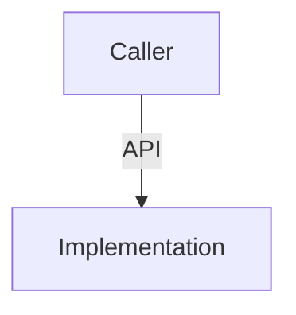

调用方只依赖 API，不需要知道内部实现。

例如：

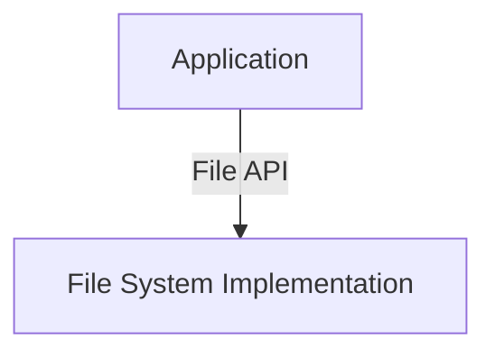

应用程序不需要知道：

- 磁盘结构
- 文件系统实现
- 数据存储方式

---

# API 与 Interface 的关系

API 是 Interface 的一种。

关系：

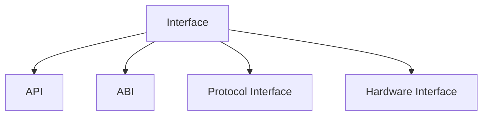

区别：

| 类型 | 面向 |
|-|-|
| API | 程序调用 |
| ABI | 二进制调用 |
| Protocol Interface | 网络通信 |
| Hardware Interface | 硬件交互 |

---

# API 与 ABI 的区别

## API

属于源码层。

例如：

```c
printf("hello");
```

程序员看到：

```
函数名
参数
返回值
```

---

## ABI

属于二进制层。

例如：

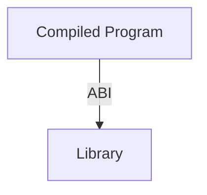

关注：

- 调用约定
- 数据布局
- 二进制兼容

---

关系：

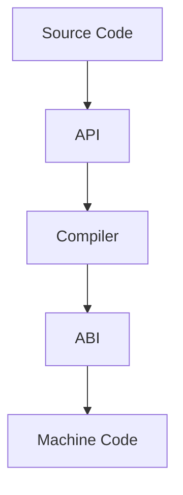

---

# API 的类型

## 1. Library API（库 API）

最常见形式。

例如：

C 标准库：

```
printf()
malloc()
strlen()
```

程序调用库提供的能力。

---

## 2. System API（系统 API）

操作系统提供给程序的接口。

例如：

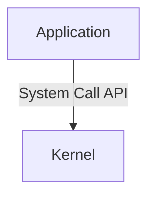

提供：

- 文件操作
- 进程管理
- 网络通信

---

## 3. Network API（网络 API）

通过网络访问服务。

例如：

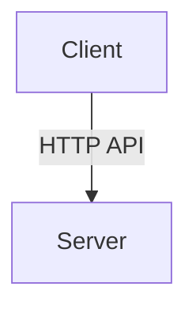

常见：

- REST API
- RPC API
- Web API

这是日常开发中最常见的 API。

---

## 4. Hardware API

程序访问硬件能力。

例如：

- GPU API
- Camera API
- Sensor API

---

# 为什么网络 API 容易让人误解？

## 初始理解

很多开发者接触 API：

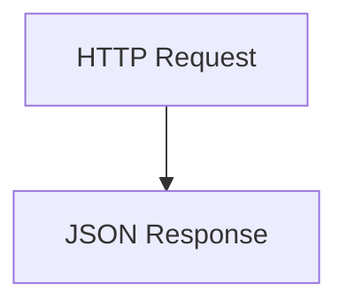

因此认为：

```
API = 网络接口
```

---

## 实际

网络 API 只是 API 的一种。

API 更早存在：

例如：

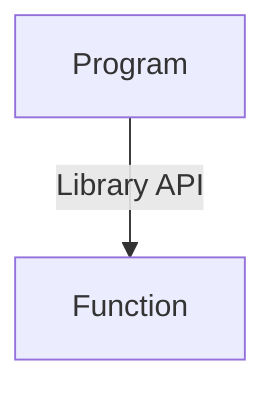

网络 API 只是：

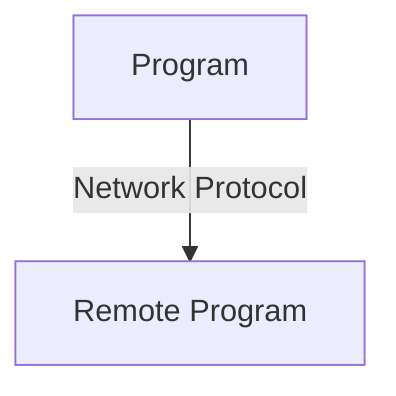

---

# API 的核心价值

## 1. 隐藏实现

例如：

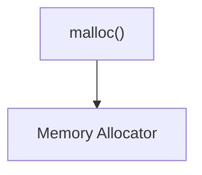

调用者不需要知道：

- 堆管理
- 内存碎片处理

---

## 2. 降低依赖

应用依赖：

```
API
```

而不是：

```
Implementation
```

---

## 3. 支持替换实现

例如：

数据库：

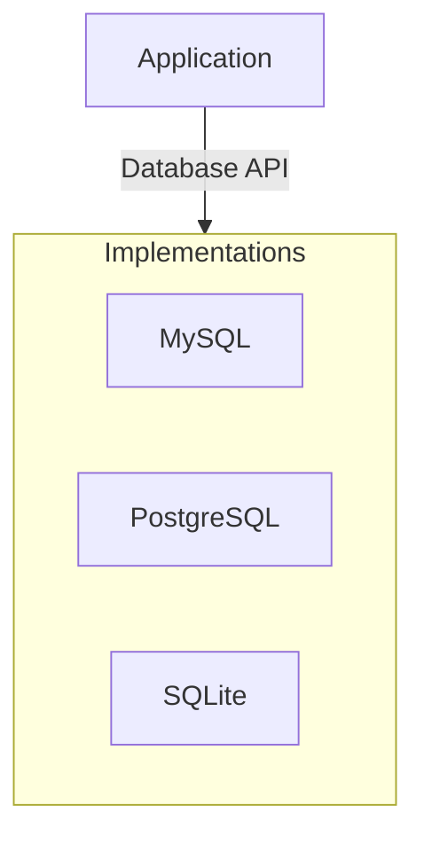

只要接口一致，上层可以变化。

---

# API 与 Abstraction 的关系

API 是抽象的具体表现。

关系：

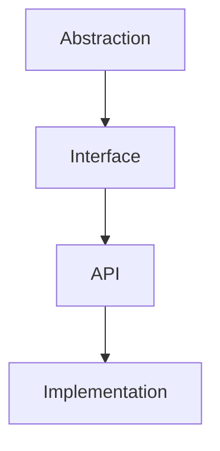

例如：

文件抽象：

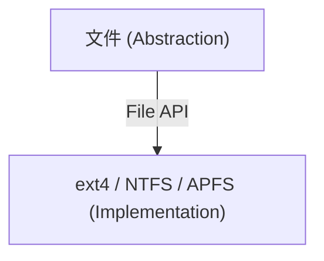

---

# Summary

API：

> API 是程序之间交互的接口规范，使程序能够使用其他模块、系统或服务提供的能力，而无需了解内部实现。

核心：

```
API = How to use

Implementation = How it works
```

注意：

```
Web API

只是 API 的一种。
```