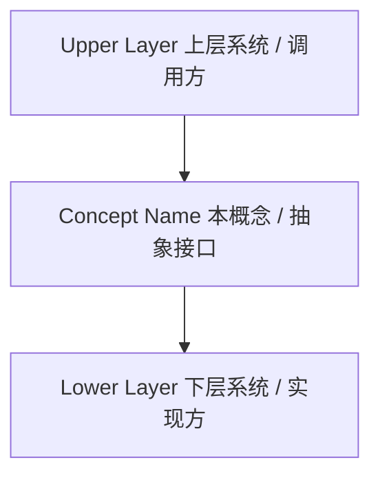
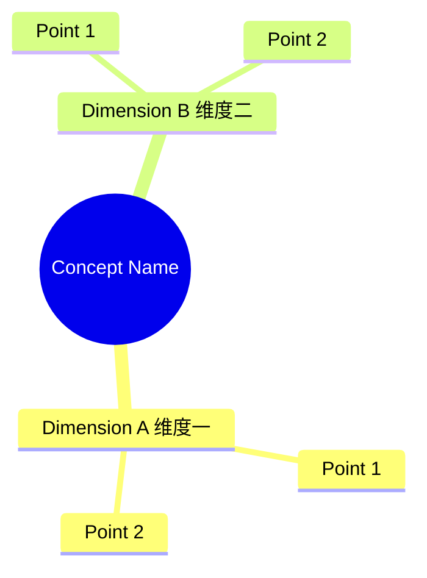

# Concept Name（中文名称）

## Definition

Concept Name 是**一句话精准定义**。

它规定 / 它负责：

- 核心职责或规范点一
- 核心职责或规范点二
- 核心职责或规范点三

简单理解：

> 一句核心金句总结（例如：API 解决源码如何调用，ABI 解决机器码如何交互）。

---

# 系统位置 / 架构关系

---

# 核心概念思维导图

---

# 核心内容 / 分类组成

## 1. 分类/组成部分一

说明...

关注点：

- 关注点 A
- 关注点 B

---

## 2. 分类/组成部分二

说明...

关注点：

- 关注点 A
- 关注点 B

---

# 核心价值 / 作用

1. **降低耦合**：说明...
2. **隐藏实现**：说明...
3. **支持替换**：说明...

---

# 与相关概念的关系

## 与 [核心设计哲学] 的关系

说明...

---

## 与 [其他横向概念] 的关系

说明...

---

# Summary

> 一句话总结该概念在系统架构中的核心价值。

核心关键词：

- Keyword 1
- Keyword 2
- Keyword 3

---

# 关联概念

- [核心哲学概念]：比如 Role vs Implementation 等
- [其他强关联概念]：比如它的下层或上层依赖
